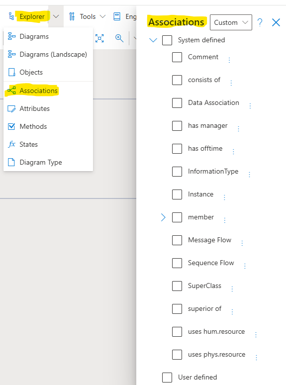
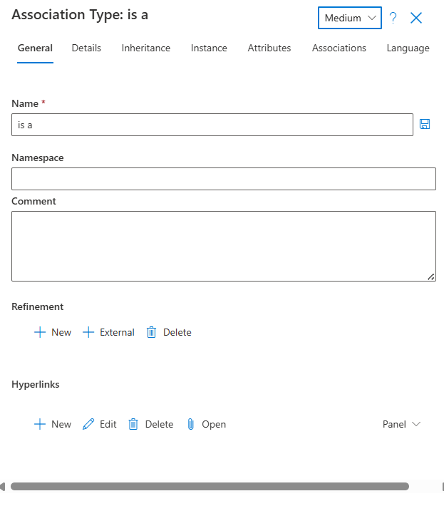

**Associations**

**Explorer Associations**: Users can navigate to different Association types located in the model to Edit, Add or Delete the Properties of each Association type or to add their own **User-Defined Associations**. 

**Associations - General - Properties**

**System defined Associations** are build according to the rules of the selected SemTalk Online methodology. The basic structure of these Associations is fixed but certain settings can be set by model **Administrators** as needed (e.g. Comments, Hyperlinks etc.).

**NOTE**: User-Defined Associations can be created but models may lose essential Reporting and Simulation capabilities so we strongly recommend using the default Associations.
