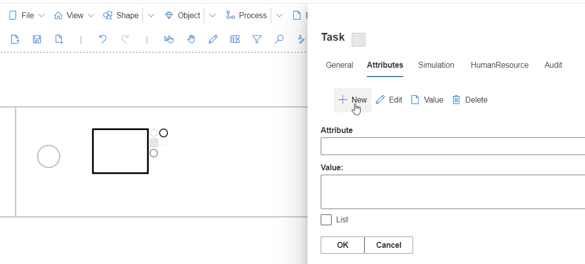
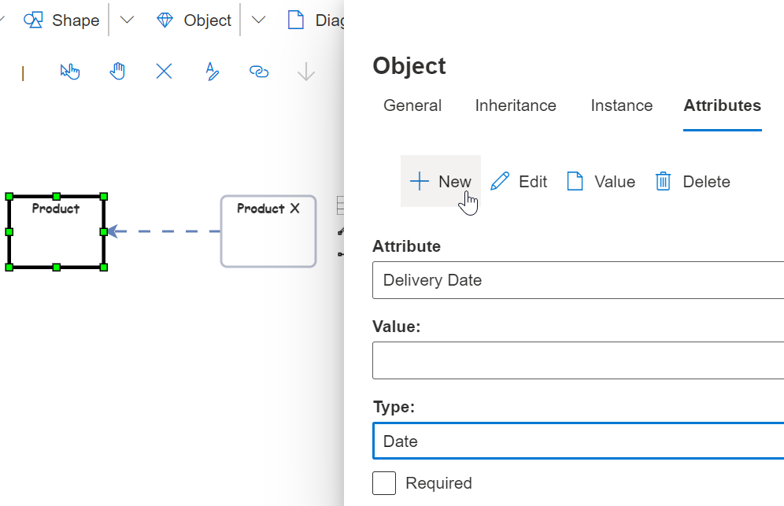

**Attributes**

**Attributes** are a set of System or User-Defined properties related to an Object. 

Right mouse click on an Object's **Properties - Attributes** tab to **Create New, Edit, and assign Attribute Values** to the Object. Attributes consist of a **Name** and a **Value**. 

For example, Tasks in a BPMN process can be categorized using **Attributes** such as **Contact Person, Phone Number, URL, or Time values**. SemTalk contains **System-Defined Attributes**, but additional Attributes can be added dynamically as needed. 

The number and types of Attibutes is not limited but the **Properties** dialog only allows users to create **New** attributes that are always created with thea **String** (text field) data type. If other Attribute data types are needed, other configuration options are available. Please refer to **Creating Complex Attributes** shown below.

If the Object's Attribute tab is not visible, add the Attribute tab via Customization.

Right click on an Object to open its **Properties** dialog and then select **Attributes - New**.

**Object - Properties - Attributes**:  will add Attribute data as it is added. These values will be stored in your model's Respository. This data can be created or managed in:

* Object - Properties - Attribute tab, 
* Using the Worksheet option, or 
* When naming Object using the Vocabulary naming function.

SemTalk Online has two Attribute types:

* **System Defined Attributes**: An Object's default Attributes, and 
* **User-Defined Attributes**: Attributes created by users for the currently active model. 

Both Attribute Types have variables with associated values. System-Defined Attributes are the standard entries shown in the Properties tabs. 

**NOTE**: Only SemTalk Online's product developers are able to change System Defined Attributes. 

## Creating Complex Attributes

SemTalk Online's GUI can be customized using Attributes and configurable layout features.

In the above example, the **Product** Object has been given the Attribute **'Delivery Date'**. **'Delivery Date'** consists of a Date variable extracted from a calendar. 

Variables can also be a **Picklist** such as **'Currency Type'** (e.g. a Picklist with US Dollars, Euros, Pounds etc.) or it could have a **Fixed Range** such as **Values from 5-100**. or a **'Delivery Date'**. These variables are defined as **Attributes in the Superclass 'Product'**. **'Product' Subclasess**. All **'Products'** (e.g.**'Product X'**), are subclasses of 'Product' and would inherit the Attribute 'Delivery Date'. Specific Values are then set at the level of each **Product**. (e.g.**'Product** X' has the **Delivery Date = June 27th, 2026**). 

Once a User-Defined Attribute has been created, it can be assigned to other Objects by choosing it from an **Attribute Picklist**. 

