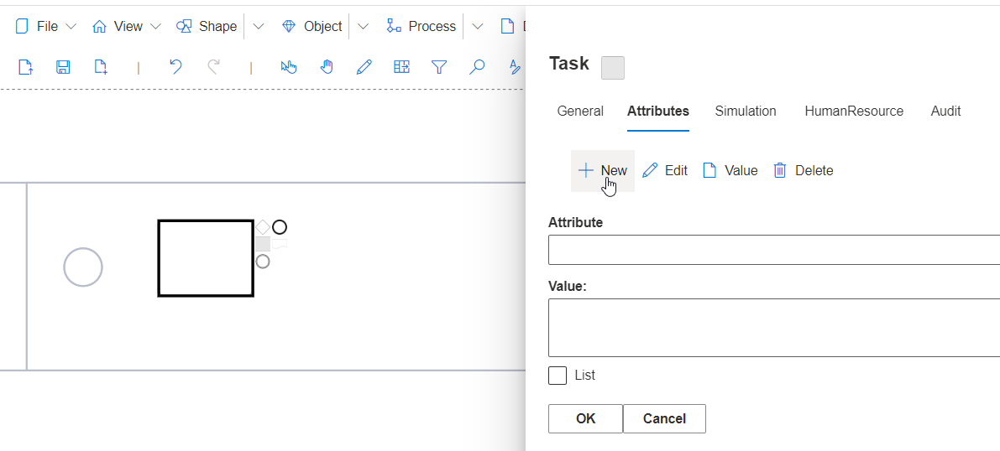
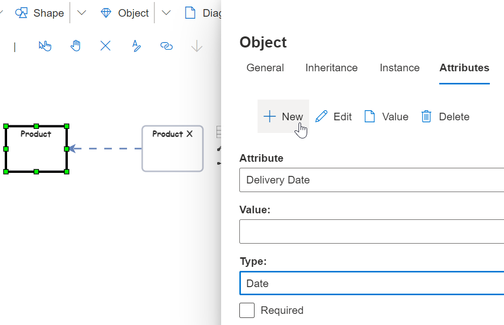

# Attributes

**Attributes** are a set of System or User-Defined Properties related to an Object. 

Attributes consist of a **Name** and a **Value**. For example, BPMN Tasks can have named **Attributes** such as **Contact Person, Phone Number, URL, or Time values**. The **Value** of the Attribute is the specific value associated with the Object. (e.g. Phone Number = +1 234-456-7890). 

SemTalk Online contains most common **Attribute Types** but model Administrators can add additional **User-Defined Attributes** as needed. 

Modelers assign existing **System Attributes** values or they create new **String** (text field) Attribute types. If other Attribute data types are needed, they can be added byt the model's Administrator. 

**NOTE**: If the Object's Attribute tab is not visible in the Object's Properties menu, the model's Administrator can turn the Attribute tab back on.

Right mouse click on an Object's **Properties - Attributes** tab to **View, Edit, and/or assign Attribute Values** to the Object. 

**Object - Properties - Attributes**: Opens associated **Attribute** data that is stored in the model's **Respository**.

**Assign Attributes** using:
* **Object - Properties - Attribute** tab, 
* **Home - Worksheet** pull-down menu option, or 
* Via the **Vocabulary - Attribute** naming function.

SemTalk Online has two **Attribute Types**:
* **System Defined Attributes**: An Object's default Attributes, and 
* **User-Defined Attributes**: Attributes created by users for the currently active model. 

Both the **Attribute Type** and the **Attribute Name** have associated **Attribute Values**. **System-Defined Attributes** are the standard entries shown in the **Properties** tabs. 

Users select **Attributes** to add to the model from the existing **Attribute Picklist.**

In the above example, the **Product** Object has been given the Attribute **'Delivery Date'**. **'Delivery Date'** has a **Date** variable extracted from a **Calendar**. 

Variables can also be **Picklists** such as **Currency Type** (e.g. a Picklist with US Dollars, Euros, Pounds etc.) or it could have a **Fixed Range** such as **Values from 5-100**. or a **'Delivery Date'**. These variables are generally defined as **Attributes** in the Superclass **Product** contain **Product Subclasess**. For example, all **Products** (e.g.**Product X**), are subclasses of the superclass **Product** that automatically inherit **Product Attributes** such as **Delivery Date**. Specific Values are then set at the level of each **Product**. (e.g.**'Product X** has the **Delivery Date = June 27th, 2026**). 

Once a **User-Defined Attribute** has been created, it can be selected from the **Attribute Picklist** for other Objects. 

**NOTE**: New **User-Defined Attributes** can only be created and modified by a **Meta-Modeler** or a model **Administrator**. 