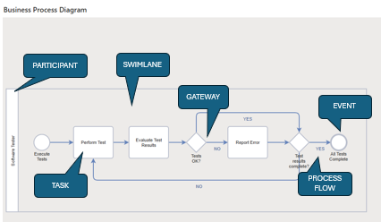

# BPMN Overview

Business processes are described graphically in SemTalk Online using the standardized **BPMN (Business Process Model And Notation)**. **BPMN** provides a set of Business Process modeling **Objects** along with guidelines for their use. SemTalk Online incorporates these **BPMN Rules** into a set of drawing **Diagrams**, each with an associated **Stencil** that contains relevant **Object** types that can be dragged and dropped onto the **Diagram** (drawing sheet). 

**BPMN** is currently published as Object Management Group (OMG) [BPMN 2.0](https://www.omg.org/spec/BPMN/2.0/).

## Core BPMN Elements:

The following is a brief description of the core elements used in a **Business Process Diagram**.
* **Events**:  Events describe singular occurrences that control a Business Process flow. These include Inputs (start), Outputs (end) and intermediary events that end or interrupt a process flow.
* **Tasks**: The specific activities executed in a process flow. Process flows are triggered by **Input Events** and end with **Output Events**. 

  **Task names** are a combination of an **Object** (noun) and a **Method** (verb). When **Gateways** are used, **Gateway** names are a combination of an **Object** and an **Attribute**.
  
    **NOTE**: When modeling with SemTalk Online, **Vocabulary** is a naming function that uses picklists of **Objects** (nouns), **Methods** (verbs)/ **Attribute** names. Using Vocabulary to name Tasks keeps model information consistent throughout the organization.  
* **Gateways**:  Change the direction of the process flow depending on the information sent by the proceeding Object. 

  Modelers set the conditions in the Gateway to trigger the appropriate successor task. 
* **Flows**: Directional **Information Flow Arrows** that connect **Task** and **Gateway** Objects to one another. They define both the order in which individual Tasks are processed and they contain the information that determines changes in the directional flow of a process.
* **Swimlanes**: Show the handoff between the **Tasks** done by each participant **Swimlane**. 

  **NOTE**: Each participant is assigned its own independent Swimlane so that it is clear which Tasks are performed by each group.

**Example:**

The following is an example of a BPMN Business Process Diagram:

Business Processes are generally read from left to right. 

A process flow begins with initial **Input Events** that contain both workload information and the initial conditions that start the process, then is shows the flow of Tasks/ Gateways with their associated information and any **Systems and/ or Resources** that are used in the process and it ends with pre-defined **Output Events**.

In the above example, the **Gateway** relates to the completion of testing results. It shows **Gateway 'Tests OK?'**, if **‘Yes’** go to **Output Event 'All Tests Complete'**, if **‘No'** go to **'Perform Test’**.

Process flows are embedded in **Swimlanes** that show who does what. **Swimlanes** also show the information flows between different Participants that are working on the same process.
