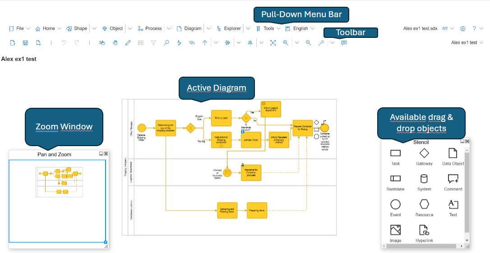
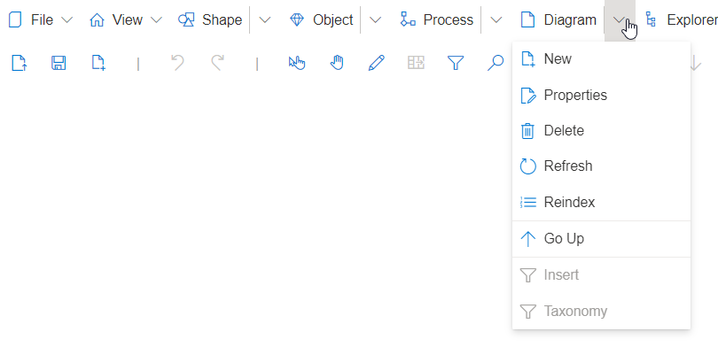

# Diagram Overview

In SemTalk Online, modeling workspaces are referred to as **Diagrams**. Each **Diagram Type** in a model has built-in **Rules**. 

The number and type of **Diagrams** correspond to each of the standard SemTalk versions.  Each SemTalk version, whether it is **BPMN**, **EPCs** or any customized version, opens a set of **Diagrams**. Each Diagram type has its own built-in rule-based engine that only allows the applicable **Objects** and **Associations**  to the selected. User-defined Diagram types can also be created, but reporting and other functions may be limited without additional customization.

**BPMN** and **EPCs** process flow **Diagrams** are the active modeling space where modelers add worksteps and information flows to create the scenarios used to represent process flows.

### BPMN Diagram Types:
* Business Process Diagrams
* Object Diagram
* Ontology
* OrgChart

### EPC Diagram Types:
* Buffer Model
* eEPC
* Knowledge Map
* Object Model
* OrgChart
* PhysResource Model
* Value Chain

## Diagram Pull-Down Menus

**Diagram - New**: Creates a new Diagram

**Diagram - Properties**: Contains all of the Properties associated with a Diagram
* Name
* Class
* Comments
* Attributes
* Conditions
* Associations
* Language
* Audit
* Created By
* Last Changed By
* (Date) Created
* (Date) of Last Change
* Delete
* Go Up
* Insert
* Taxonomy

**Diagram - Delete**: Deletes the active Diagram

**Diagram - Reindex**: Reindexes refined Tasks

**Diagram - Go Up**: Opens the parent process Diagram

**Diagram - Insert**: Inserts external Objects into a model

**Diagram - Paste**: Inserts copied process elements onto a Diagram. This feature is specifically designed for end users who are using cell phones or tablets that do not have a right mouse click option.