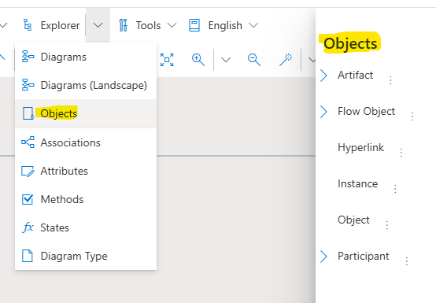
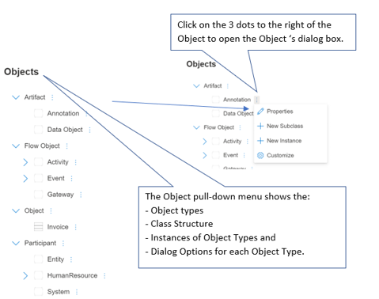

**Explorer Objects**

The **Explorer Objects** pull-down menu gives users the ability to create, edit and manage Objects in their models.

Available Object types are: 

**Artifacts**: Either Annotations (e.g. comments and links that are not specific to a particular Object) or Data Objects.

**Flow Objects**: These are the model connectors that determine how Objects relate to one another. Flow Objects are differentiated based on whether the flows are between Activities, Events or Gateways.

**Objects**: This menu shows Objects that have been created. Shown objects can be edited or deleted. New Objects can also be created. Obects are shown as a hierarchy of Object classes and subclasses.

**Participants**: Participants are the human and technical actors involved in work flows. They could be entities, such as Departments, Specific actors such as the name of the person doing the action or they can be Systems such as the CRM system or a particular technology such as Microsoft Teams.

**Customize Option**: Users often have unique needs. Customized allows users to add their own properties to Object dialog boxes.

Here is an example of a BPMN Object pull-down menu:

