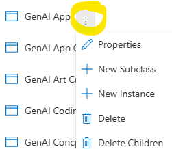

# Explorer Pull-Down Menu

**Pull-Down Explorer** menu allows users to visualize the model's logic and to navigate to differnt model components. The Explorer allows users to Browse to the item, Open the Object's Properties or they can Delete the Object. 

Click on the directional arrows to expand and collapse the view of the Model's elements. After each entry there are three verticle dots. Click on these dots to Browse to where the **Object** is used in the model, to Edit an object's Propertiesnor to Delete an Object. 

**NOTE**: When you Edit or Delete an **Object**, the changes will be propagated to all **Objects** of this type found in your model.

**Explorer** allows users to go to the Diagram where an Object is found. In the Explorer Navigation Tree some of the Objects have a grey icons. This signifies that the Object can be found on a Diagram. When you click on the 3 dots next to the Object, a Browse menu will appear.

After selecting an **Object** in the Navigation Tree, users can also add Subclasses and Instances to the Object or delete the Children (Subclassed ) of a Class

