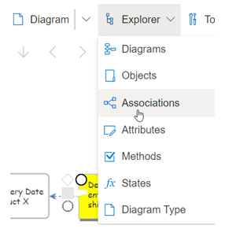
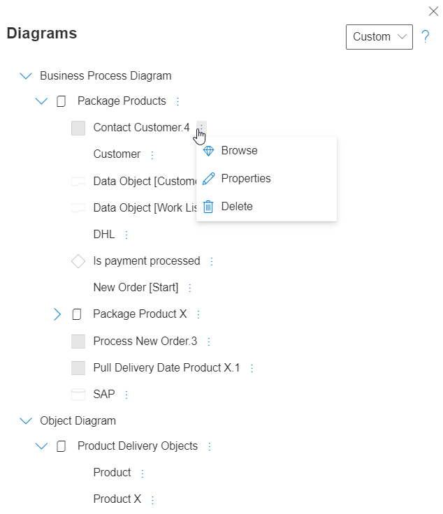
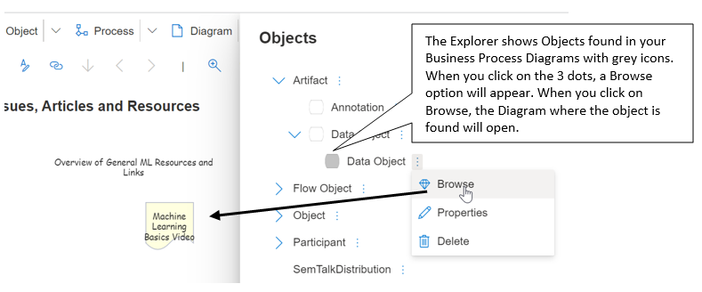

The pull-down Explorer function allows you to navigate to, and manage Objects and Diagrams in your model. A Panel will open showing the model's elements. Click > or < to expand and collapse the view of the Model's elements. After each entry are three verticle dots. Click on these dots to Browse/ view and edit Properties or to Delete an Object. When you edit or Delete a Model elements, the changes will be propagated to all Objects of this type in your model.

Explorer Browse allows users to navigate to the diagram where an Object is found. In the Explorer navigation tree, you will see that some of the Objects have a grey icons. This signifies that the Object can be found on a Diagram. When you click on the 3 dots next to the Object, a Browse menu will appear.

