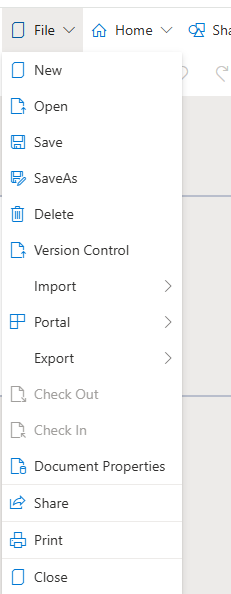
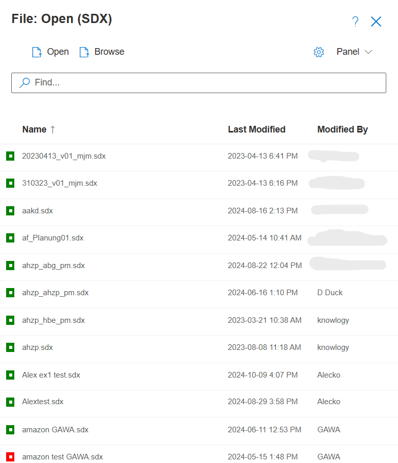

# File Menu

**File** manages the selection of new and available files that can be accessed or exported.

**File New**:

**File Open**: Opens a selectable list of all available models along with their CheckIn/ CheckOut status. If you open a model that is checked out by another user, you will see a red error message next to the model name in your Explorer stating that the model is checked out to <user x>. 

Save As creates a new model version or it allows model Administrators to check the model back in. Files are either stored locally on your **Computer** or they are selected via the available  **Database** model list. When selecting Database models, SemTalk automatically updates associated data such as the date last **Modified**, the last author in **ModifiedBy** and the **CheckOut** status. Files can be selected by Name, Date, and Last Modified status.

**File - Save or Save_As**: Saves or Save As to overwrite or add Database files

**File - Import**: Imports other SemTalk Models, Merges multiple Models together or Imports OWL models and BPMN models.

**File - Delete**: Deletes the currently opened Diagram

**File - Version Control**: Shows a picklist of previous model versions so that users can go back to an earlier version of the model

**File - Portal**: Turns on the Portal Approval function or it Publishes the Model to a SemTalk Portal

**File – Import / Export**: Saves models in different modeling formats based on downloaded SemTalk Online modules

**File – Check In / Check Out**:  Controls access to modeling features to minimizing model inconsistencies and errors.

**File - Document Properties**: Adds documentation features such as Date Created, Created By, Date and Time of last Revision and data about who created and edited the SemTalk Model. This meta data can be extended and modified as needed.

**File - Share**: Creates a link so the model so that others can view (but not edit) static views of the model 

**File – Image File**: Exports the active diagram as a SVG file

**File – Print Preview**: Shows the layout of print pages

**File - Close**: Closes the active model and immediately opens a new empty model of the same kind

