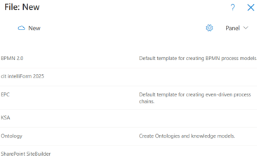

# File New

New model files can be created via the menu item “File” --> “New.”

NOTE: Open models should be saved before creating a new model to avoid data loss.

All available notations and templates are listed in the open dialog box. These may also include user-defined templates derived from one of the (standard) notations. Select a notation name and click the “New” button to save a new Model File.

See [Working with Ontologies](https://github.com/SemTalkOnline/SemTalkOnline/wiki/Working-with-Ontologies) to learn more about Ontologies.
