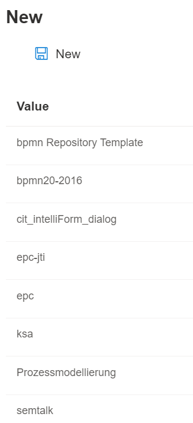

# File New

New model files can be created via the menu item “File” --> “New.”

Open models should be saved before creating a new model to avoid data loss.

All available notations and templates are listed in the open dialog box. These may also include user-defined templates derived from one of the (standard) notations. Select a notation name (gray bar) and click the “OK” button to complete the creation process.

If you want to know more about working with ontologies, follow this link Working with Ontologies!