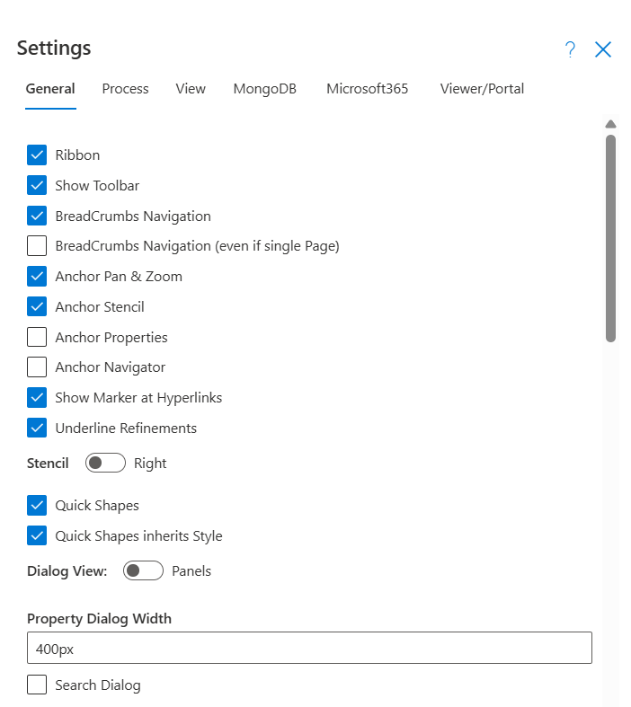
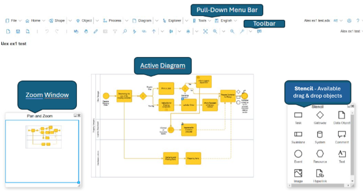
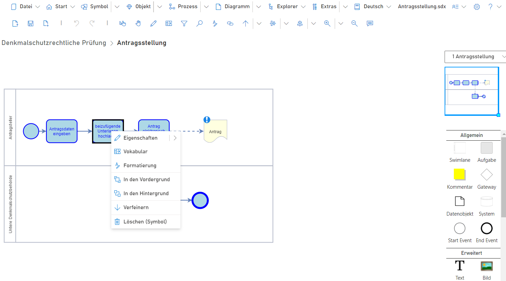
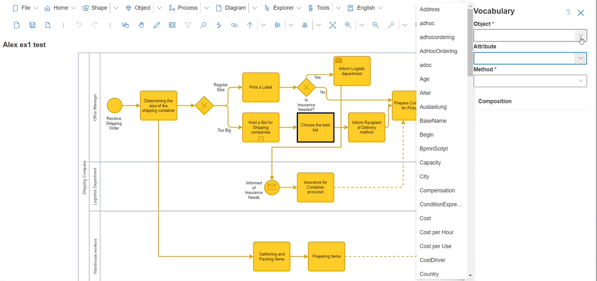
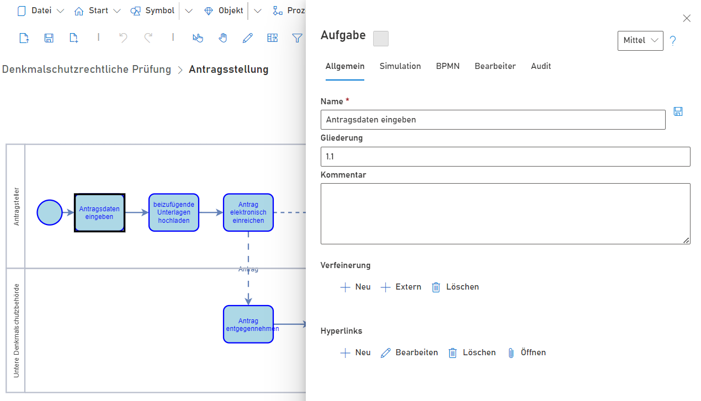

## Getting Started with SemTalk

This overview reviews the most important steps for new SemTalk Online users to help them to optimally setup SemTalk Online to meet their modeling requirements.

## Login / Registration
This section is only relevant if MongoDB is used. User that use SemTalk Online in Microsoft365 environments will not need to register accounts or use a seperate login.

If a user account already exists, proceed directly to the login process. Authorized **Roles** for the user will appear in the picklist. Users with assigned basic modeling tasks should select the  **Editor Role**.

A more detailed explanation of the login screen can be found here:
[Wiki Page: SemTalk-Login](https://github.com/SemTalkOnline/SemTalkOnline/wiki/SemTalk-Login) 

## Registration

If a user account does not exist, Registration can be performed if this function is enabled in the application. Demo users are able to register for testing purposes free of charge and will automatically be assigned the Editor role. Demo users should leave the Product Key entry empty.

A more detailed explanation of the registration screen can be found here:
[Wiki Page: SemTalk-Registration](https://github.com/SemTalkOnline/SemTalkOnline/wiki/SemTalk-Registration) 

## SemTalk Online GUI (Editor View)

## Stencil, Pan & Zoom Window & Navigation

* The **Stencil** shows the Objects that can be dragged and dropped onto the Diagram. 

* **Pan & Zoom** window allows users to navigate to different areas of the **Diagram**

* **Navigator** opens a navigation window with arrows that correspond to process flow arrows. 
* Up arrows go to the parent process 
* Down arrows go to the process refinement
* Left and right arrows go to the process step before or after the selected Object

The SemTalk Online default setting is to show all of the modeling Commands as well as the Stencil and Pan & Zoom windows. Users can select what appears in the modeling view in the **Settings - General** menu. Here users can **Anchor** the **Stencil**, **Pan & Zoom** and **Navigator** windows. This is where modelers turn on and off what they need. (e.g. If a model is opened and it is missing key modeling windows, this is where users go to turn those windows back on.)

**Settings - General - Anchor** is used to Anchor windows to the left or the right side of the Diagram.

**Other Key Modeling Features**:
- **Breadcrumb Navigation**: When a model contains multiple linked Diagram pages, a breadcrumb path can be displayed to help navigate between linked pages.
- **Display Hyperlinks as Icons**: This option is used to show a hyperlink icon on Objects that have associated hyperlinks.
- **Underline Refinements**: This setting is used show if a Refined BPMN Object is Refined. The **Task Name** will be underlined. If this option is disabled, the standard BPMN “+” symbol will be shown.

## Pull-Down Menu Structure

Please click on the following links for additional information about specific Pull-Down Menus 
Specific are described in detail on other wiki pages. Please follow the links below to learn more:
- [File](https://github.com/SemTalkOnline/SemTalkOnline/wiki/File-Menu)
- [Home](https://github.com/SemTalkOnline/SemTalkOnline/wiki/Home-Menu)
- [Shape](https://github.com/SemTalkOnline/SemTalkOnline_DE/wiki/Menüeintrag-Symbol)
- [Object](https://github.com/SemTalkOnline/SemTalkOnline_DE/wiki/Menüeintrag-Objekt)
- [Process](https://github.com/SemTalkOnline/SemTalkOnline_DE/wiki/Menüeintrag-Prozess)
- [Diagram](https://github.com/SemTalkOnline/SemTalkOnline_DE/wiki/Menüeintrag-Diagramm)
- [Explorer](https://github.com/SemTalkOnline/SemTalkOnline_DE/wiki/Menüeintrag-Explorer)
- Tools]

## Creating Models

**SemTalk Onlines's Graphical User Interface (GUI)**

SemTalk Online's modeling workspace is referred to as a Diagram. 

Available **Diagram Objects** are shown in the **Stencil** window found to the right of the active Diagram. Objects shown in the Stencil conform to the modeling rules of the SemTalk Online version in use. (e.g. Process Diagrams, eEPCs,OrgCharts and Object Diagrams)

Users **Add Objects** to the Diagram by dragging and dropping Objects from the Stencil onto the Diagram or by inserting Objects that have previously been modeled using the Insert command. 

**Name Objects** by double clicking on the Object, by opening the object's right-mouse click menu or by using the Vocabulary naming option discussed below. 

**Connect Objects** by hovering your cursor over the center of an Object until the hand icon appears. Hold down your cursor and draw the connection to the next object. 

Connection types are also related to the Diagram type. Users are able to create user-defined connectors but it is generally not recommended because user-defined connectors are not considered when running process flow consistency checks. 

Process objects have a auto-draw connector feature. This allows users to automatically create connectors when they choose the object's target object.

**Structured Object Naming via Vocabulary**

In addition to naming objects via double-click and right mouse click, SemTalk also includes a structured naming option. Most process work-steps have names that consist of a verb and a noun. For example, the process step 'Send Invoice' is the verb 'Send' and the noun 'Invoice'. 

When adding new Object names to process flow objects, instead of simply adding a name, modelers using the Vocabulary option select the Object (noun) and Method (verb) from picklists. If the Object and Method are not in the picklist, they can add them to the local Repository. Keeping modeling information consistent is especially important when there are multiple modeling projects and/ or multiple people modeling or when the models are being used to support training. 

Repositories can be local on only be related the the active model or they can be centralized so that everyone in the organization uses the same terminology. 

## Business Process Diagrams

Business Process Diagrams are where Process Flows are described. Process flows are generally created within Swimlanes or Swimlane Pools but they can also be show indepedently.

## Swimlanes:

NOTE: When working with **Swimlanes** and **Swimlane Pools** it is recommended to first create and position all Swimlanes/ Swimlane Pools before placing other Objects onto your Diagram because future editing is more complicated due to the container behavior of Swimlanes and Swimlane pools.

Additional Information about swimlanes can be found here:

- [Wiki page: Swimlanes](https://github.com/SemTalkOnline/SemTalkOnline/wiki/Swimlanes)

## Business Process Diagram Objects:
- Tasks
- Gateway
- Data Object
- Swimlane
- System
- Comment
- Event (e.g. Inputs/ Outputs)
- Resource
- Text
- Image
- Hyperlink

## BPMN Task Object Properties

Access a BPMN's Task Object's **Properties** dialog via:
* Right mouse click on the Object
* Double click on an Object 
* Toolbar Object tab
* Toolbar Pencil icon

Task Object **Properties**:
* **General** ( Name, Index number, Comments and Hyperlinks)
* **Simulation**: Paramenters that are used when simulation the process flow
* **HumanResource**: The org units and human resources that execute the process step
* **Assignments**: Defines process flow variables of a process. Variables defined here are can be used in simulations and when specificallymodeling IT system functions. (e.g. If a contract is greater than $1000 dollars it flows one way and if it is under $100 is flows in a differt direction.)
* **Audit**: This tab shows the edit history and the modeling team members associated with the Object.

**Connect Objects in Process Diagrams**: 

Use an Object's Quick Template by hovering your mouse over a Task Object. Click on the Object that you want to connect and the next Object and the connector will be created. 

Additional Topics:

- Create a **Refinement** (Subprocess):
[Wiki page: Refinements](https://github.com/SemTalkOnline/SemTalkOnline/wiki/Refine)
- **Format** an Object: [Wiki page: Style](https://github.com/SemTalkOnline/SemTalkOnline/wiki/Styleg)
- **Hyperlinks**: [Wiki page: Hyperlinks](https://github.com/SemTalkOnline/SemTalkOnline/wiki/Hyperlinks)

