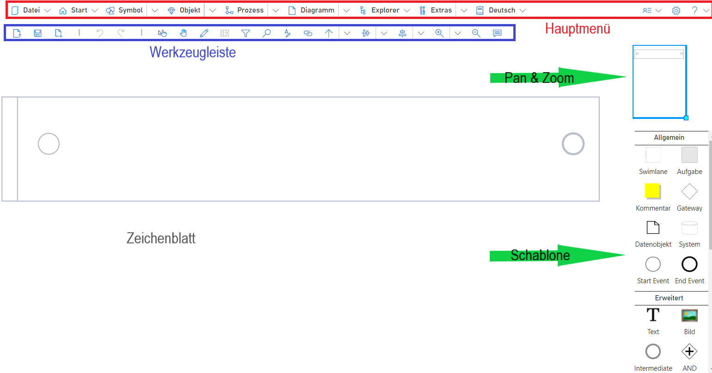
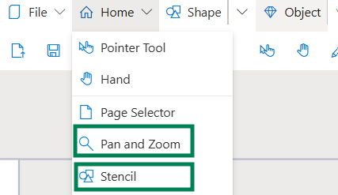
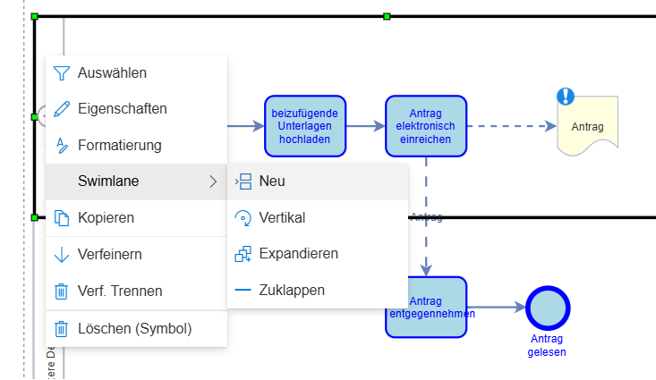

# Getting Started with SemTalk

This wiki page provides an initial overview of the most important steps for setting up the SemTalk Online environment for new users.
It is therefore recommended to become familiar with these first steps in order to optimally adapt your SemTalk Online environment to your own requirements.

## Login / Registration
This section is only relevant if MongoDB is used. User that use SemTalk Online in Microsoft365 environments will not need to register accounts or use a seperate login.

If a user account already exists, you can proceed directly to the login process. The selected role must be assigned to the user.
A user with basic modeling tasks should have the Editor role and select it during login.

A more detailed explanation of the login screen can be found here:
[Wiki Page: SemTalk-Login](https://github.com/SemTalkOnline/SemTalkOnline/wiki/SemTalk-Login) 

## Registration

If no user account exists, registration can be performed—provided this function is enabled in the application.
In the demo application, users can freely register for testing purposes and will automatically be assigned the Editor role.

A more detailed explanation of the registration screen can be found here:
[Wiki Page: SemTalk-Registration](https://github.com/SemTalkOnline/SemTalkOnline/wiki/SemTalk-Registration) 

# Configuring the SemTalk Online Interface (Editor View)

## Template, Pan & Zoom Window, and More

Important tools for successfully creating process models include the template with modeling elements and the pan & zoom window.
Depending on the basic configuration of the application and user preference, these tools can be customized.

In the Start menu, the tools can be shown or hidden (the same applies to the page selection window and the navigator).
This means that if these tools are not visible after opening the editor, you may need to enable them manually.

Furthermore, the positioning of the tools can be configured. In the Options menu (gear icon in the top right), under the General tab, you can define whether the tools should be anchored on the left or right side of the editor.
This can be set via the “Template” switch.
If the anchoring option is not selected, the tool will appear in a movable window that can be freely repositioned and resized.

Additional useful options for beginners:
- Breadcrumb navigation bar: If a file contains multiple linked drawing pages, a breadcrumb path can be displayed to help navigate between diagram pages.
- Display hyperlinks as icons: If hyperlinks are used during modeling, this option must be enabled so that small indicator icons appear on model elements with hyperlinks.
- Underline refinements: In BPMN notation, refinements can be used. Refined tasks can either have their name underlined to indicate refinement or, if this option is disabled, show the typical BPMN “+” symbol.

## Menu Structure

The main menu contains a variety of functions.
These are described in detail on other wiki pages. Follow the links below to learn more:
- [Wiki page: Menu File](https://github.com/SemTalkOnline/SemTalkOnline/wiki/File-Menu)
- [Wiki page: Menu Home](https://github.com/SemTalkOnline/SemTalkOnline/wiki/Home-Menu)
- [Wiki page: Menu Shape](https://github.com/SemTalkOnline/SemTalkOnline_DE/wiki/Menüeintrag-Symbol)
- [Wiki page: Menu Object](https://github.com/SemTalkOnline/SemTalkOnline_DE/wiki/Menüeintrag-Objekt)
- [Wiki page: Menu Process](https://github.com/SemTalkOnline/SemTalkOnline_DE/wiki/Menüeintrag-Prozess)
- [Wiki page: Menu Diagram](https://github.com/SemTalkOnline/SemTalkOnline_DE/wiki/Menüeintrag-Diagramm)
- [Wiki page: Menu Explorer](https://github.com/SemTalkOnline/SemTalkOnline_DE/wiki/Menüeintrag-Explorer)
- [Wiki page: Menu Tools](https://github.com/SemTalkOnline/SemTalkOnline_DE/wiki/Menüeintrag-Extras)

## Getting Started with Modeling

SemTalk Online is model-based, meaning that new files are created via File → New, each belonging to the selected notation.
Each file can contain several diagram pages, which can then be filled with the actual models.

To build a process model, the following steps are generally relevant:

- Symbols can be dragged from the template onto the drawing sheet to create models.
- Double-clicking on an object allows you to quickly rename it — alternatively, use the Object Properties dialog.
- Object properties can be adjusted via the context menu (right-click), e.g., attachments/hyperlinks, comments, assignees, and other attributes.
- Alternatively, via the Object tab in the menu ribbon.
- Connections can be created by clicking and dragging from the center of one object to another with the left mouse button.
- Hovering the mouse over an existing symbol displays the Quick Template next to it. Clicking one of the quick elements allows you to rapidly add connected symbols.
- To create a subprocess, refinements are used in SemTalk Online. [Wiki page: Refinements](https://github.com/SemTalkOnline/SemTalkOnline/wiki/Refine)
- The appearance of symbols can be customized with numerous formatting options. Learn more here: [Wiki page: Style](https://github.com/SemTalkOnline/SemTalkOnline/wiki/Styleg)
- Hyperlinks can be added to most symbols. Different hyperlink options are described here: [Wiki page: Hyperlinks](https://github.com/SemTalkOnline/SemTalkOnline/wiki/Hyperlinks)
- To convert a Swimlane (in BPMN) into a Pool containing multiple swimlanes, right-click on the header of the pool/swimlane and select Swimlane → New from the context menu.
SemTalk Online will then create a new swimlane within the selected pool/swimlane.
However, if you want to create an entirely new pool, drag the swimlane symbol from the template onto the drawing sheet.
When working with pools and swimlanes, it is recommended to first create and position all pools and swimlanes before placing other elements inside them, as later rearrangement can be difficult due to the container behavior of pools/swimlanes.

## Object Properties

- Every SemTalk element has basic properties that can be controlled via the Properties dialog.
- To open:
    - Right-click on a symbol → Properties
    - Menu entry Object → Properties
    - Toolbar Pencil icon
- Name, comments, hyperlinks, and attributes can be entered.
- Depending on the element type, refinements, assignees, or other notation-specific settings may also be available.

Users **Add Objects** to the Diagram by dragging and dropping them from the Stencil onto the Diagram. 

**Name Objects** by double clicking on the Object, by opening the object's right-mouse click menu or by using the Vocabulary naming option discussed below. 

**Connect Objects** by hovering your cursor over the center of an Object until the hand icon appears. Hold down your cursor and draw the connection to the next object. 

Connection types are also related to the Diagram type. Users are able to create user-defined connectors but it is generally not recommended because user-defined connectors are not considered when running process flow consistency checks. 

Process objects have a auto-draw connector feature. This allows users to automatically create connectors when they choose the object's target object.

**Structured Object Naming via Vocabulary**

In addition to naming objects via double-click and right mouse click, SemTalk also includes a structured naming option. Most process work-steps have names that consist of a verb and a noun. For example, the process step 'Send Invoice' is the verb 'Send' and the noun 'Invoice'. 

When adding new Object names to process flow objects, instead of simply adding a name, modelers using the Vocabulary option select the Object (noun) and Method (verb) from picklists. If the Object and Method are not in the picklist, they can add them to the local Repository. Keeping modeling information consistent is especially important when there are multiple modeling projects and/ or multiple people modeling or when the models are being used to support training. 

Repositories can be local on only be related the the active model or they can be centralized so that everyone in the organization uses the same terminology. 

