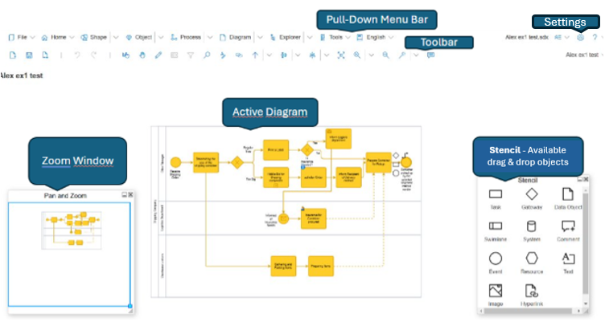

## Getting Started with SemTalk

This overview reviews the most important steps for new SemTalk Online users to help them to optimally setup SemTalk Online to meet their modeling requirements.

## Login / Registration
This section is only relevant if MongoDB is used. Users that use SemTalk Online in Microsoft365 environments will not need to register accounts or use a seperate login.

If a **User Account** already exists, proceed directly to login and select an **Authorized Role**. Users assigned basic modeling tasks should select the  **Editor Role**.

A more detailed explanation of the login screen can be found here:
[Wiki Page: SemTalk-Login](https://github.com/SemTalkOnline/SemTalkOnline/wiki/SemTalk-Login) 

## Registration

If a user account does not exist, complete **Registration**. 

**Demo Users** can Register free-of-charge for testing purposes. The **Editor Role** is automatically assigned. Demo users should leave the Product Key entry empty.

A more detailed explanation of Registration can be found here:
[Registration](https://github.com/SemTalkOnline/SemTalkOnline/wiki/SemTalk-Registration) 

## SemTalk Online User Interface (Editor View)

## Stencil, Pan & Zoom, & Navigation

* The **Stencil** shows the Objects that can be dragged and dropped onto the Diagram. 

* **Pan & Zoom** window allows users to navigate to different areas of the current **Diagram**

* **Navigator** opens a navigation window with arrows that correspond to process flow arrows. 
* **Up Arrows** go to the parent process, 
* **Down Arrows** go to the process refinement, and
* **Left and Right Arrows** go to the process step before or after the selected Object.

## Settings 

Users can customize what appears in the modeling view by clicking on the **Settings Icon**  in the upper right corner of SemTalk Online window and selecting **Settings - General**.

Use the **Settings - General** commands to **Show, Hide or Anchor Windows**

 Turning off modeling tool windows is especially helpful when getting feedback from process experts because the focus remains on the process flow Diagram, not the the modeling command windows.

Other Key **Settings - General** Commands:
- **Breadcrumb Navigation**: When a model contains multiple linked Diagram pages, a breadcrumb path can be displayed to help navigate between linked pages.
- **Display Hyperlinks as Icons**: This option is used to show a **Hyperlink Icon** on Objects that have associated hyperlinks.
- **Underline Refinements**:  Used to show if a BPMN Object is Refined. The **Task Name** will be underlined. If this option is disabled, the standard BPMN **+** symbol will be shown.

 

**NOTE**: The SemTalk Online default setting is to show all  **Modeling Commands** as well as the **Stencil and Pan & Zoom** windows. 

## Pull-Down Menu

Please click on the following links for additional information about specific Pull-Down Menu items.

- [File](https://github.com/SemTalkOnline/SemTalkOnline/wiki/File-Menu)
- [Home](https://github.com/SemTalkOnline/SemTalkOnline/wiki/Home-Menu)
- [Shape](https://github.com/SemTalkOnline/SemTalkOnline_DE/wiki/Menüeintrag-Symbol)
- [Object](https://github.com/SemTalkOnline/SemTalkOnline_DE/wiki/Menüeintrag-Objekt)
- [Process](https://github.com/SemTalkOnline/SemTalkOnline_DE/wiki/Menüeintrag-Prozess)
- [Diagram](https://github.com/SemTalkOnline/SemTalkOnline_DE/wiki/Menüeintrag-Diagramm)
- [Explorer](https://github.com/SemTalkOnline/SemTalkOnline_DE/wiki/Menüeintrag-Explorer)
- Tools]

## Creating Models

SemTalk Online's modeling workspace is referred to as a **Diagram**. 

**Objects** that can be dropped onto the active **Diagram** are shown in the **Stencil** window which is generally found to the right of the active Diagram. 

Objects shown in the **Stencil** conform to the modeling rules of the SemTalk Online version in use. (e.g. Process Diagrams, eEPCs,OrgCharts and Object Diagrams)

**Add Objects** to the **Diagram** by dragging and dropping Objects from the **Stencil** onto the Diagram or by inserting Objects that have previously been modeled using the **Insert** command. 

**Name Objects**:
- Double-click on the Object, 
- Open the object's right-mouse click menu, or
- Use the **Vocabulary** naming option discussed below. 

**Connect Objects**: 
- Hover the cursor over the center of an Object until the hand icon appears with the associated Quick Shapes. Select the desired Quick Shape Object Icon and the New Object and connector will appear on your Diagram. 
- Use the **Auto-Draw Connector** to automatically create connectors and connector Objects or 
- Hold down your cursor on an Object and drag the arrow to an existing Object. 

**NOTE**: Available Connection types are also related to the active Diagram type. Users can create user-defined connectors but it is generally not recommended because user-defined connectors are not considered when running process flow consistency checks. 

### Structured Object Naming via **Vocabulary**

In addition to naming objects via double-click and right mouse click, SemTalk includes a structured naming option. Most process work-steps have names that consist of a verb and a noun. For example, the process step 'Send Invoice' is the verb 'Send' and the noun 'Invoice'. 

When adding new Object names to process flow objects, instead of simply adding a name, use the **Vocabulary** option to select the Object (noun) and Method (verb) from **Picklists**. If Objects and Methods are not in the shown picklist, they can be added to the current model or, if the user is a model Administrator, they can be uploaded into the central **Repository**. 

Keeping organizational modeling information consistent via shared, centrallized **Repositories**, is especially important when there are multiple modeling projects and/ or multiple people modeling or when models are used for training. 

## Business Process Diagrams

**Business Process Diagrams** are where Process flows are described. Process flows are created within **Swimlanes** and **Swimlane Pools** but or they can be show indepedently without Swimlanes.

**NOTE**: When working with **Swimlanes** and **Swimlane Pools** it is recommended to first create and position all Swimlanes/ Swimlane Pools before placing other Objects onto your Diagram because future editing is more complicated due to the container behavior of Swimlanes and Swimlane pools.

Additional Information about swimlanes can be found here:

[Swimlanes](https://github.com/SemTalkOnline/SemTalkOnline/wiki/Swimlanes)

## Business Process Diagram Objects:
- Tasks
- Gateway
- Data Object
- Swimlane
- System
- Comment
- Event (e.g. Inputs/ Outputs)
- Resource
- Text
- Image
- Hyperlink

## BPMN Task Object Properties

Access a BPMN's Task Object's **Properties** dialog via:
* Right mouse click on the Object
* Double click on an Object 
* Toolbar Object tab
* Toolbar Pencil icon

Task Object **Properties**:
* **General**: Name, Index number, Comments and Hyperlinks
* **Simulation**: Paramenters that are used when simulating the process flow
* **HumanResource**: The org units and human resources that execute the process step
* **Assignments**: Define process flow variables. Variables are used in simulations and when modeling IT system functions. (e.g. If a contract is greater than $1000 dollars it flows one way and if it is under $100 is flows in a differt direction.)
* **Audit**: Shows the Edit history and the Modeling Team members who have edited the Object.

**Connect Objects in Process Diagrams**: 

* Hold the cursor down on the Source Object and drag and release the cursor on the Target Object

* Hover your cursor over the source Object until a hand appears and the Quick Shape objects appear. Select the desired Quick Shape's Target Object.

Additional Topics:

- Create a **Refinement** (Subprocess):
[Refinements](https://github.com/SemTalkOnline/SemTalkOnline/wiki/Refine)
- **Format** an Object: [Style](https://github.com/SemTalkOnline/SemTalkOnline/wiki/Styleg)
- **Hyperlinks**: [Hyperlinks](https://github.com/SemTalkOnline/SemTalkOnline/wiki/Hyperlinks)

