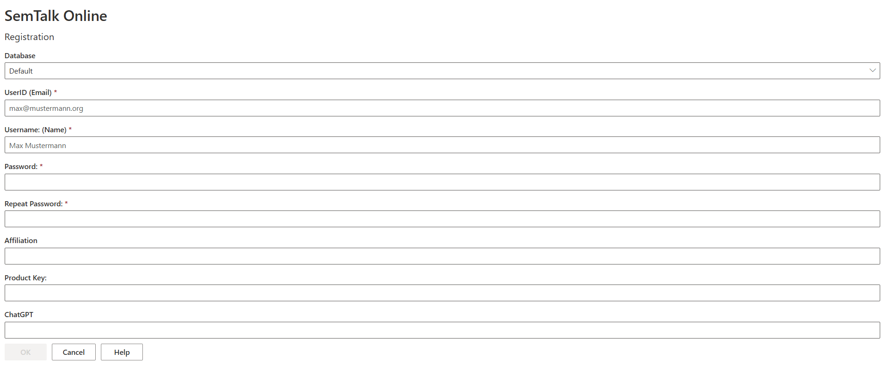

**Getting Started with SemTalk**

This overview reviews the most important steps for new SemTalk Online users to help them to optimally setup SemTalk Online to meet their modeling requirements.

**Login/ Registration**

This section is only relevant when MongoDB is used. Microsoft365 environment users do not need to register accounts or use a seperate login.

If a user account already exists, you can proceed directly to the login process. The selected role must be assigned to the user. A user with basic modeling tasks should have the Editor role and select it during login.

Additional information about the Login Screen can be found under the [SemTalk-Login](https://github.com/SemTalkOnline/SemTalkOnline/wiki/SemTalk-Login) help page.

If you forgot your login password, enter your email address and select the Resend Password option and you will be sent a temporary new password. After you login, go to the Tools - User pull-down menu and create a new password. 

If a user account does not exist, Registration can be performed if this function is enabled in the application. Demo users are able to register for testing purposes free of charge and will automatically be assigned the Editor role. Demo users should leave the Product Key entry empty.

A more detailed explanation of the Registration screen can be found under [SemTalk-Registration](https://github.com/SemTalkOnline/SemTalkOnline/wiki/SemTalk-Registration).

**Configuring the SemTalk Online Interface (Editor View)**

**SemTalk Onlines's Graphical User Interface (GUI)**

SemTalk Online's modeling workspace is referred to as a Diagram. Each Diagram type has specific objects that can be dragged and dropped onto the active Diagram based on the SemTalk Online version in use (e.g. Process Diagrams, eEPCs,OrgCharts and Object Diagrams). 

Diagram objects are shown in the **Stencil** window found to the right of the active Diagram.  Objects in the Stencil conform to the modeling rules of the SemTalk Online version being used. 

Users **Add Objects** to the Diagram by dragging and dropping them from the Stencil onto the Diagram. 

**Name Objects** by double clicking on the Object, by opening the object's right-mouse click menu or by using the Vocabulary naming option discussed below. 

**Connect Objects** by hovering your cursor over the center of an Object until the hand icon appears. Hold down your cursor and draw the connection to the next object. 

Connection types are also related to the Diagram type. Users are able to create user-defined connectors but it is generally not recommended because user-defined connectors are not considered when running process flow consistency checks. 

Process objects have a auto-draw connector feature. This allows users to automatically create connectors when they choose the object's target object.

**Structured Object Naming via Vocabulary**

In addition to naming objects via double-click and right mouse click, SemTalk also includes a structured naming option. Most process work-steps have names that consist of a verb and a noun. For example, the process step 'Send Invoice' is the verb 'Send' and the noun 'Invoice'. 

When adding new Object names to process flow objects, instead of simply adding a name, modelers using the Vocabulary option select the Object (noun) and Method (verb) from picklists. If the Object and Method are not in the picklist, they can add them to the local Repository. Keeping modeling information consistent is especially important when there are multiple modeling projects and/ or multiple people modeling or when the models are being used to support training. 

Repositories can be local on only be related the the active model or they can be centralized so that everyone in the organization uses the same terminology. 

