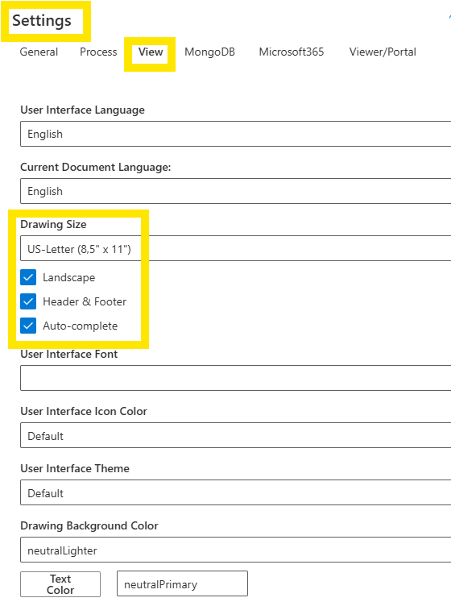
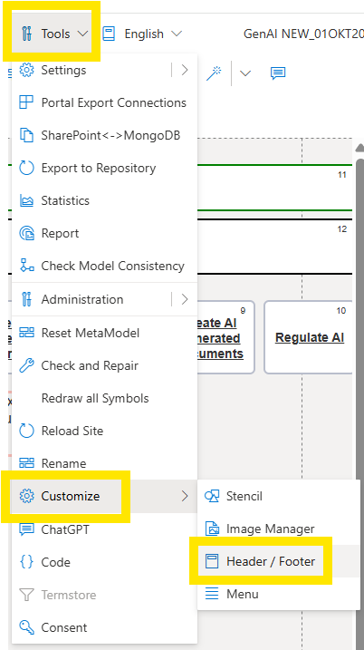
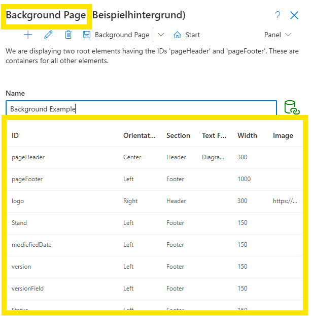

# Headers and Footers
SemTalk Online allows users to customize Headers and Footers lables for **Model Files** and **Diagrams** background pages.

## Set Up the Background Pages

Since the elements of a background page are based on the Diagram size, it is necessary to set a fixes Diagram size and Orientation. For more information, go to Diagram.
Once a Diagram format has been defined, the Background page, with header and footer information can be activated. 

Go to **Settings - View** and set the Drawing Size settings to **US Letter** and click the **Landscape, Header & Footer and Auto-Complete** checkboxes to the **On** position.

## Background Pages Editor

Customize the **Background Page** in the  **Tools - Customize - Header Footer** pull-down menu. 

Edit the **Background Page Header/ Footer** settings as needed.

