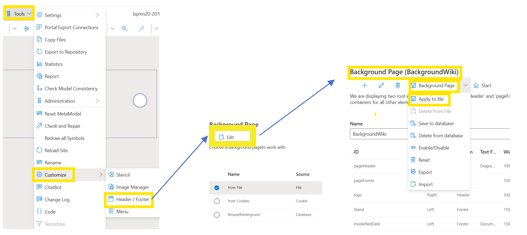
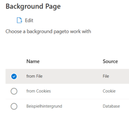
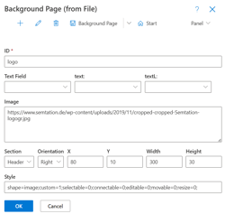
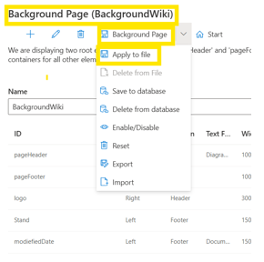

# Header and Footers

**Headers & Footers** are a subset of **Background Pages**. They show additional information on the **Diagram** such as **Diagram Name and Version**. They can be set at for all **SemTalk Online Models** and **Diagrams** or just for specific **Models** and/ or specific **Diagram Pages**. 

## Setting up Background Pages

Diagram **Background Pages Settings** define the **Page Size, Layout, Style and Placement** settings for **Diagram Pages**. 

For additional information about **Background Page Setting** please refer to the following sections for additional information.

[Layout Align Distribute](https://github.com/SemTalkOnline/SemTalkOnline/wiki/Layout-Align-Distribute)

[File Format and Properties](https://github.com/SemTalkOnline/SemTalkOnline/wiki/File-Format-and-Properties)

Once a **Diagram Background Page** is defined, it can be edited in the **Tools - Customize - Header & Footer** pull-down menu.

Select **from File** and then select Edit.

Three types of of **Background Diagram Settings** will be shown. Each example includes standard settings such as **Diagram Name** and **Logo** in the **Header**. These can be easily edited to fit the needs of each organization.

## Background Page Editor

The **Header and Footer Editor** is used to customize **Diagram Background Pages** to meet organizational requirements. **Tools -  Customize - Header/Footer Background Page** lists all previously defined Background Pages and it used to create new **Background Page** templates.

**Background Pages** are defined as:

**Files**: **Background Pages** are selected from a list of previously saved **Background Page** templates. Templates can be opened, modified, and saved back to the Model file.

**Cookies**: Local default **Background Page** settings that can be used as a basis for creating **Background Pages**.

**NOTE**: When working on a **Background Page**, the current version is always stored as a local **Cookie** on the user's computer.

**Database (when using MongoDB)**: **Background Page** can be stored in **MongoDB** if the user is logged in as an **Administrator**. These can then also be used by all other users for their model files. Double-click on one of the entries or click to select the desired **Background Page**.

If **Background Pages** do not exist in the **File or Database**, the **Background Page** in the user’s **Cookies** is automatically opened. In this case, there is no separate **Start Page**.

**Creating and Editing a Background Page in an Open Dialog**: **Background Pages** can be created, edited, deleted, exported, imported, and reset to their default state by selecting **Start** to opens the existing overview page.

**Editing Individual Components of a Background Page**:
Background Pages consist of fields that can be populated dynamically or defined with fixed values. Existing fields are listed as a table in the open Diagram.

**NOTE: IDs pageHeaders and pageFooters** must not be deleted because they contain settings for all other **Background Page** elements. **Size and/ or Orientation** can be edited. 

## Header and Footer Properties

**ID**: The unique name for each field shown in a Diagram's Background Page. **NOTE**: Each ID Field Name is an unique name.

**Text**: Enables the display of information from the Model or from a Diagram component (e.g. File Name, Diagram Name, Comment, Page Number, or Date). 

**Document** metadata can also be used.

**Text and TextL**: Available language entries can also be used to populate field names (e.g.as labels for other fields). This options is used when integrating multi-language translations.

**Image**: A Base64-encoded image can be entered here, which will then be displayed in the field. Using a converter such as https://base64.guru/converter/encode/image, an image can be converted into a Base64 string and then inserted into the background page field.

## Formatting:

**Area**: Determines whether the field is displayed in the **Header or Footer**.

**Orientation**: Determines how the field is aligned within the area.

**X and Y**: These are the detailed coordinates where the fields are displayed.

**Width and Height**: Height and width of the field

**Formatting**: Additional formatting properties (e.g. Font, Font Size and Color etc.) can be integrated by selecting an existing entry and then clicking the **Pencil Icon** in the menu, or by using the **+** button to create a new entry.

**Applying a Background Page to a File**: **Background Pages** are displayed directly on the **Diagram's** drawing sheet. This setting is only available locally in the user's modeling environment. 

If the Background Page should be applied to all users who open the file, select **Apply to File** in the **Background Pag** menu entry. The newly configured **Background Page** is then applied to the **Model File** and is permanently viewed by all users.

**Background Page Settings** can also be used to import or export settings in JSON format or to reset the settings to its default state.

### Example of a Background Page

Creating and configuring **Background Pages** is complex so it may be necessary to experiment until the desired results are achieved.

The following example illustrates how different **Diagram Background Page**  fields interact and to show how they can be positioned.

Open **Tools - Customize - Header / Footer** pull-down menu and click on 
**Database BackgroundWiki** and click on **Edit**. Modify the existing settings by clicking on an existing entry and then click on **Pencil Edit Icon**, or click on the **+** button to create a new entry.

### Applying a Background Page to a File

Changes made to the **Background Page's Settings** will be immediatedly displayed directly on the Diagram's drawing sheet. These settings apply only in the modeler's environment. If these setting should apply to all users who open the file, select **Apply to File** found in the **Background Page Pull-Down Menu**. The configured Background Page is saved to the open SemTalk Online Model file and becomes permanently set for all model file users.

**Page Options** (e.g. A4, Landscape etc.) in the **Setting - View - Pull-Down Menu**. Click the **Header & Footer** checkbox.Default setting will appear below. If Logos are assigned, they will appear in the right corner. The **Footer** and **Page Number** will be inserted along with any assigned descriptive fields such as the **Last Modification Date** and **Comments**.

**IDs pageHeader and pageFooter** contain the settings for all other fields.
**Footers** are generally smaller than **Headers**. Select the row with the **ID pageFooter** and click on the **Pencil Icon** to edit. Change the **Height** field to 40 and select **OK**.

A field labeled **Page** will be inserted. Create a new entry by selecting the **+** icon. An unique **ID** will be assigned and the position of the new entry will be set. The field should be located in the top-left corner of the **Footer** with the orientation set to **Left**. 

**X and Y** fields are used to perform precise pixel-level positioning within the **Footer**. T default values are set to **0** and **0**. The **Width** is set to accomodate the length of the text. 

In the shown example, the **Width** is set to 100 and the **Height** is set to 40 so that it matches the settings for the **Footer**. The the field text should be set in the **Page** option. Either type the text directly into the field or select the text value **Page** from the pull-down list. 

SemTalk Online contains these option and allows them to be set for multiple languages. Options can also be reused for **Background** pages. Click **OK** to save the new **Settings**.

Actual **Page Numbers** should be inserted usong the **+** icon. Select the position to match the position shown above. Click on the **X** icon and set the coordinate to 100 to match the settings of the **Field Width**. The new **Page Number** field will be placed directly behind the first field. Set the width of the new **Page Number** field to 50 since the **Page Number** field requires less space. 

Select **Diagram: Outline** in the **Text Pull-Down** menu to see the page number of the current **Diagram**. If a **Page Number** does not appear, **Diagram Page Numbers** have not yet been numbered. Add **Diagram Page Numbers** in the **Diagram - Reindex** pull-down menu. 

This menu will also show the **ID (Internal identifier)** in the **Text** field. It will appear as highlighted entries that must be selected to continue to Steps 4, 5, and 6.
Click **OK** to complete the process.

The **Last Modification Date** is created in the same way. The **X Coordinate** must be set to 150, since the two previous fields total width is 150. The **Width** can be set back to 100. In the **Text** field, select **Document: Modified**. Click **OK** to complete the process.

The last **Diagram Properties** field is  **Diagram - Comment**. The **X** coordinate must be set to 250 and the length should always be set to 800 to insure that a **Comment** will fit into the field.

The **Background Page** is now complete. The modified **Background Page** can be saved and retrieved as a **JSON file** so that it can be imported in other Models using the **Header and Footer** dialog.

**NOTE**: When positioning fields it is best to work with **Borders** when first defining **Background Pages**. In **Formatting - strokeColor** set this field to **(strokeColor=black;)**. Add a black **Border** around the field. This makes easier to see the exact size and position of the field on the **Diagram**. Remove the **Border** once the placement is completed.
  

[def]: images/BackgroundPageEdit2.png