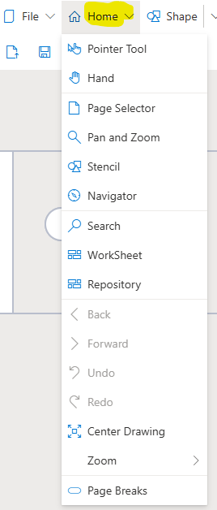

# Home Pull-Down Menu

The **Home** menu allows users to: 
* Customize SemTalk Online's GUI, 
* Access key functions such as [Search](https://github.com/SemTalkOnline/SemTalkOnline/wiki/Search)
* View the underlying [Repository](https://github.com/SemTalkOnline/SemTalkOnline/wiki/Repository)
* Access special tools such as SemTalk  [worksheet](https://github.com/SemTalkOnline/SemTalkOnline/wiki/Worksheet)
* Refresh Menus
* Customize layout for export to other applications by inserting page breaks.

