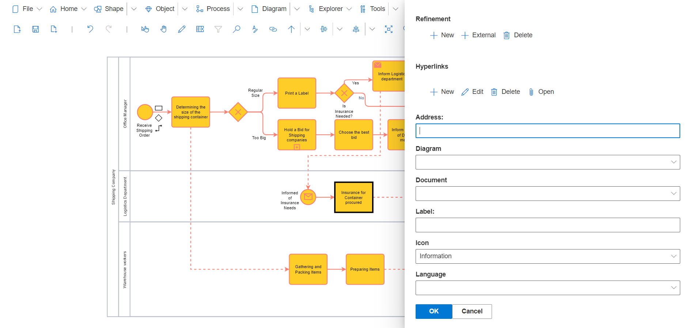

**Hyperlinks**

Hyperlinks allow additional internal and external information to be integrated into a Diagram. This increases the ability of the model to be better understood and it allows the integrations of existing documentation and forms. 

Address:
The URL is entered here.

Diagram:
If a model contains more than one Diagram or drawing sheet, another Diagram within the model can be referenced as a Hyperlink.
Attention: Otherwise this field will not be displayed in the dialog (highlighted in yellow here)!

Document:
Here, instead of a URL, you can also select a document (represented by a *.sdx file), i.e. a model from the model database, to use it as the target of the hyperlink. If this is not required, the field can be left blank.

Advertisement:
A descriptive name can be added to a hyperlink for display. This will later be visible to the user instead of the actual URL.

Icon:
Here you can select a specific icon from a selection list, which later identifies the object that has a hyperlink stored.

Language:
A language can be selected for which the hyperlink applies, so that different URLs, possibly with different languages, can also be displayed in multilingual modeling. If the field is left blank, the hyperlink is valid for all languages.
