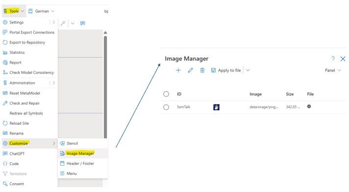

# SemTalk Online and Images

SemTalk Online is designed to use visual information to help people quickly understand what is being represented in the active worksheet. Associated worksheet Stencils show the standard objects specific to the worksheet in use. Core Stencil objects are partially specific to the methodology in use. Stencils contain object types specific to the active methodology as well as general objects such Images as the specific also contain additional Images, Text and Hyperlinks  that enhance the model's utility. 

NOTE: When inserting Images into a model it is critical to minimize the overall impact on the model's file size. Using Hyperlinks and SVG files help. If there are Images that will be used multiple times, users should always first check to make sure that the Image has not already been uploaded. 

**Ways to Integrate Images:**

**External Hyperlinks:** This is used for images that are stored and uploaded from a central file location. Changes, deletions and access restrictions made to the primary image are propagated to all instances of the image in all models that contain the image. A core benefit of this approach is that external hyperlinks do not affect the size of the model file.

**Embedded base64 Encoded Image Strings:** Images can be permanently integrated into the model file as base64-encoded character strings. 

Please refer to section: [Convert images to base64](./image-manager#convert-images-to-base64)!

The primary advantage of this method is that the Image does not have to be loaded from an external source so it is always immediately accessible to every model user. A disadvantage is that any changes made to the Image will not be propagated to the model's other Diagrams or to other models where the object is used. 
NOTE: Model file size can quickly become very large (even too large) if the model contains embedded i\Images. Embedded objects should be used for Images that do not change or for Images that are specific to individual models and/or those Images that cannot be obtained from a reliable external source.

**As Unique Symbols:** Images can be added directly to model diagrams. This makes sense if an Image only appears once in the model. 

**Image Manager:** An integraded Image administration interface designed to upload and manage Images, especially those that are used often, or to manage models that contain many Images. Images are uploaded here and transferred directly into the model file. This allows several modelers to contribute and collectively manage Images so that they can be used for all modeling needs. 

# Integrating Hyperlinks Using the Hyperlink Symbol

This option inserts a Hyperlink Symbol onto a Diagram where relevant Hyperlinks can be added.
Hyperlink Image icons are placed on the drawing sheet. After the Hyperlink has been added to the image, users rught click on the Hyperlink object to open available Hyperlinks. 
Insert Hyperlinks Objects by dragging  and dropping the Hyperlink object from the Stencil onto the Diagram. 

Then right click on the newly created Hyperlink object and select Properties to add a Name to the Hyperlink object and to add the Hyperlinks associated with the Hyperlink object. Add each Hyperlink by selecting **+ New** and then select **Save** to add the Hyperlink information to the object. 

# Adding Images via the Formatting Dialog

If an image icon is placed on the drawing sheet, you can open the formatting dialog by right-clicking --> Formatting (or Menu Icon-->Formatting). This has an “Image” tab.

Here, you can either specify an external hyperlink or embed an Image file converted to base64. To do this, please refer to the section: [Convert Images to base64](./Image Manager#Convert Images to base64)!

The image can then be embedded into the file.

If a name for the Image is entered in the ID field, the Image created can then also be reused in the formatting dialog of other Image symbols via the selection box labeled ID.

# Image Manager

## Open Image Manager

The image manager is opened via the menu item Tools --> Customize --> Image Manager.

The window that opens will then list all existing images in the file with their names, contents, sizes, and whether they are already saved in the file.
The menu bar offers a wide range of options for working with images.

## Image Manager Menu List

Here, you can either use an external 
* New (+ symbol): Allows you to create a new image in the image manager
* Edit (pencil symbol): Existing images can be edited
* Delete (trash can symbol): Images can be deleted
* Apply to file: If images are to be embedded in the file, they must first be applied to the file and are then ready for use
* Remove from file: Images can be removed from the file. If they are already in use, the corresponding image shape loses its content. You can see whether an image is saved in the file by checking the “File” column in the overview menu of the image manager.
* Export/Import: The configuration from the image manager can be exported or imported so that a set of images can be easily transferred to other model files
A hyperlink can be specified or a base64-converted image file can be embedded. To do this, please reread the section:

## Working With the Image Manager

The Image Manager lists all existing images. However, it should be noted that images created using the Image Manager initially only exist in the Image Manager of the currently open model. To transfer one or more images to the file, select the “Transfer to file” menu item. Only then are the images embedded in the model. This procedure ensures that the images can first be created and checked correctly before they have any effect on the model file. In the same way, the images can then be removed centrally from the file by clicking on “Remove from file” in the menu.
Images that are embedded in the file have a check mark in the File column.
To add a new image or edit an existing one, use the “New” or ‘Edit’ buttons in the menu bar. An image entry always consists of an ID, i.e., a unique name, and the image content in the “Image” field. This can be either a URL or the base64-converted character string of an image.
If many base64-embedded images are used, it is important to keep an eye on the size of the images. The more images are stored in the model file, the larger it becomes, which can lead to longer loading times. Problems can also arise when exporting the model to a publication database if the file becomes too large. For this reason, the file size for export is limited to approximately 10 Mb. SemTalk Online will display a warning message in the Image Manager if the file size exceeds approximately 7 Mb. If you do not intend to export to a publication database, you can ignore the warning.

# Convert Images to base64

To embed an image in a SemTalk Online model, the file must be converted to a base64 string.
SemTalk Online does not offer its own conversion tool for this purpose, but links to a freely accessible one at https://base64.guru/converter/encode/I. Converters from other providers can also be used.

To convert the image, it must first be uploaded to the conversion service, the output format must be set to “Data URI -- data:content/type;base64,” and then the Encode button must be pressed.
The result can then be copied into the “Image” field in SemTalk Online. If the process was successful, SemTalk Online will immediately display a preview of the image in the dialog box.

