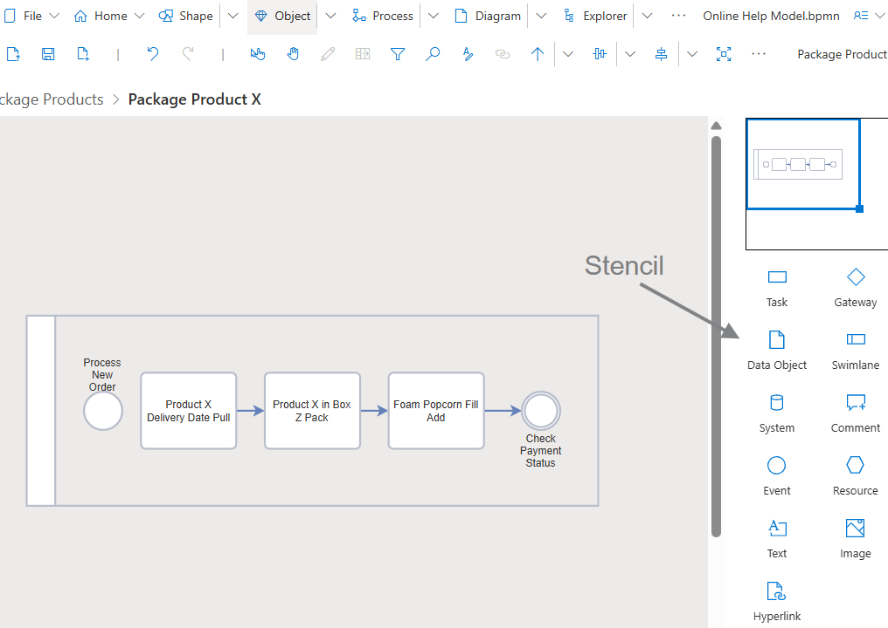
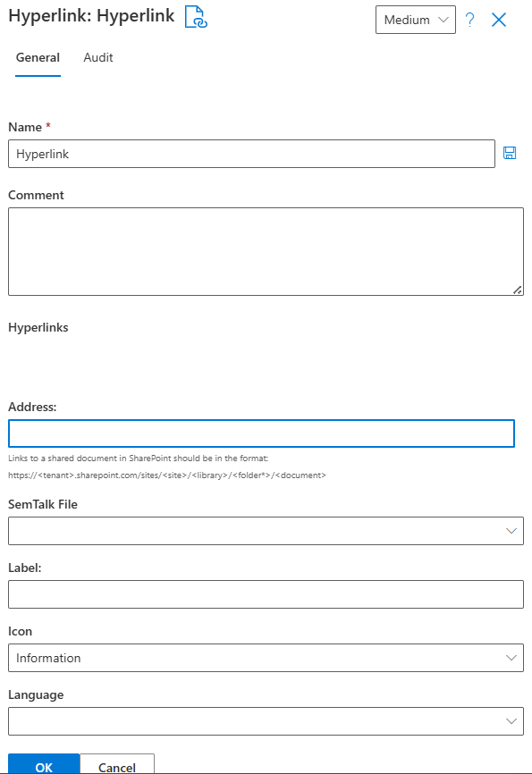
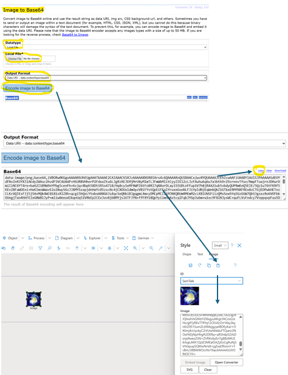
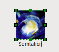

# SemTalk Online and Images

SemTalk Online is designed to allow modelers to add additional visual information to help people quickly understand the information represented in a model. Visual information is comprised of standard representations of Objects specific to the selected model methodology (e.g. BMPN and EPC). 

Each Diagram type has an associated Stencil that shows the Objects that can be dragged and dropped onto the active Diagram in use. 

Additional visual information such as Text, Images, Hyperlinks and shown Attribute information can be modified as needed on all Diagram types.

**NOTE**: When inserting Images into a model it is critical to minimize the overall impact on the model's file size. Using Hyperlinks and SVG files help. Before a new image is added, users should always first check to make sure that the Image has not already been uploaded. 

**Ways to Integrate Images:**

[**External Hyperlinks**](https://github.com/SemTalkOnline/SemTalkOnline/wiki/Hyperlinks): When the same **Image** will be used in multiple models, or in multiple **Diagrams**, inserting an [**Image Hyperlink**](https://github.com/SemTalkOnline/SemTalkOnline/wiki/Hyperlinks) is preferable because edits, deletions and access restrictions can be managed in one location and propogated to all models and Diagrams where it is used. The most import anvantage of using Image Hyperlinks is that centrally managed Hyperlinks do not impact a model's file size.

**Embedded base64 Encoded Image Strings:** Objects that need to be permanently integrated into the model file require that the image first be be converted into base64-encoded character strings. 

Please refer to section: 
[Convert images to base64](https://github.com/SemTalkOnline/SemTalkOnline/wiki/image-manager#convert-images-to-base64)

The image does not have to be loaded from an external source so it is always immediately accessible to every model user. A disadvantage is that any changes made to the Image will not be propagated to the model's other Diagrams or to other models where the object is used. 

**NOTE**: When inserting **Embedded Images**, a model's file size can quickly become large - so large that the model will no longer open. **Embedded Image Objects** should only be used for **Images** that do not change, **Images** specific to an individual model, and/or **Images** that cannot be obtained from a reliable external source.

**As Unique Symbols:** Images that are only used once can be added directly to a Diagrams as a unique image. 

**Image Manager:** An integraded **Image Administration** interface that is used to insert external **Images** onto a **Diagram**. 

**Images** that are uploaded using **Image Manager** can be created as unique images/ symbols that are only used on the active Diagram where they were uploaded, or they can be saved as an **Image File** that can be used in multiple **Diagrams**. This feature allows several modelers to contribute and collectively manage **Images** so that they can be used for all modeling needs. 

## Integrating Hyperlinks Using the Stencil Hyperlink Symbol

This option inserts a **Hyperlink Symbol** onto a **Diagram** where relevant Hyperlinks can be added.

**Hyperlink Image Icons** are placed on the **Diagram** and specific Hyperlinks are added to the **Hyperlink Image Icon**. Once added, users right click on the **Hyperlink Image Icon** to open available Hyperlinks. 

Insert Hyperlink Objects by dragging and dropping the Hyperlink object from the Stencil onto the Diagram. 

Right click on the newly created Hyperlink Icon and select Properties to name the Hyperlink Icon object and to add specific Hyperlinks. Add each Hyperlink by selecting **+ New** and then select **Save**. 

## Adding Images via the Style Dialog

If an image icon is placed on the Diagram, open the Style dialog by right click - Style or by selecting the Object and using **Image** in the [**Style**](https://github.com/SemTalkOnline/SemTalkOnline/wiki/Style) pull-down menu.

This dialog is used to manage external Hyperlinks and/or Image files that are converted to base64. Please refer to the section **Convert Images to base64** shown below.

Give the Image an **ID** (name).

Once the ID name for the Image is entered, the Image can be reused using the formatting dialog of other Image symbols via the selection box labeled ID.

# Image Manager

### Open Image Manager

Open **Image Manager** via the **Tools - Customize - Image Manager** pull-down menu to view a list of all existing Images files with their ID, Name, Size, and File Name.

## Image Manager Menu List

If this is the first Image to be added to the model, select **New (+ symbol)** to create a new Image in the Image Manager.

If Images exist, use this menu to:

* **Edit** (pencil symbol): Existing images can be edited
* **Delete** (trash can symbol): Images can be deleted
* **Apply to file**: If images are to be embedded in the file, they must first be applied to the file and are then ready for use
* **Delete from file**: Images can be removed from the file. If they are already in use, the corresponding image shape loses its content. You can see whether an image is saved in the file by checking the “File” column in the overview menu of the image manager.
* **Export/Import**: Existing Image Manager configurations can be exported orso that they can be imported into other model files
* **Hyperlinks** can be specified or a base64-converted image file can be embedded. Please refer to **Convert Images to base64** section below for additional information.

## Working With the Image Manager

**Tools - Customize - Image Manager** lists all existing **Images**. **New Images** can be created using the **Image Manager** but those images will only exist in the currently opened **Diagram**. 

If the new Image needs to be available for all modeling needs, select the **Apply to files** icon in the Image Manager pull-down menu. Only then are the images embedded in the model. This ensures that an **Image** can first be created and checked before it has any effect on the model file size. Images can also be removed centrally in the **Image Manager - Delete from file** pull-down menu.

**Images** embedded in a File have a check mark in the File column. New images can be added or edited using the **New** or **Edit** buttons in the menu bar. An **Image** entry always consists of an **ID**, i.e., a unique name, and the image content in the **Image** field. This can be either a URL or the base64-converted character string of an Image.

If multiple **base64-embedded images** are used, keep an eye on the size of the images. The more images that are stored in the model file, the larger the file size. Large files take longer to load. Problems can also arise when exporting the model to a publication database. Because of these restrictions, the file size for export is limited to approximately 10 Mb. SemTalk Online will display a warning message in the Image Manager if the file size exceeds 7 Mb. If you do not intend to export the model to a publication database, you can ignore the warning.

# Convert Images to base64

Base64 is used to create **Embedded Image Files** that are either single-use Images or multi-use Images that can be used throughout the model. Both variants require that the Image first be converted into a base64 string. 

There are two base64 conversion options. The first is the pull-down menu **Tools - Customize - Image Manager - New (+)** that can be used for either single or multi-use Images via the "Apply to file" option. The second option is the **Style-Image**  menu option when a single use Image is used.  

SemTalk Online does not offer its own conversion tool, it uses the freely accessible tool found at https://base64.guru/converter/encode/I. If needed, it is also possible to use other base64 converter tools. 

Before starting the base64 encoding process:
1. Drag and drop an Image Object onto a Diagram
2. Select the object with a single click 
3. Open the **Tools-Customize-Image Manager-New (+)** or right mouse click on the Image and select the **Style-Image** menu for single use Images
4. If you are using the **Image Manager**, give the Image a unique name in the ID box
5. Click on the **Open Converter** button

In the base64 Converter tool:

6. Select **Local File**
7. Set the Output Format to **Data URI-data:content/type.base64**
8. Click on the **Encode image to Base64** button
9. Use the base64 Converter **Copy** button to select all the encoded string
10. Copy the selected string 
11. Paste the encoded string into the **Image box**

 If the process was successful, SemTalk Online will immediately display a preview of the image in the dialog box. 

