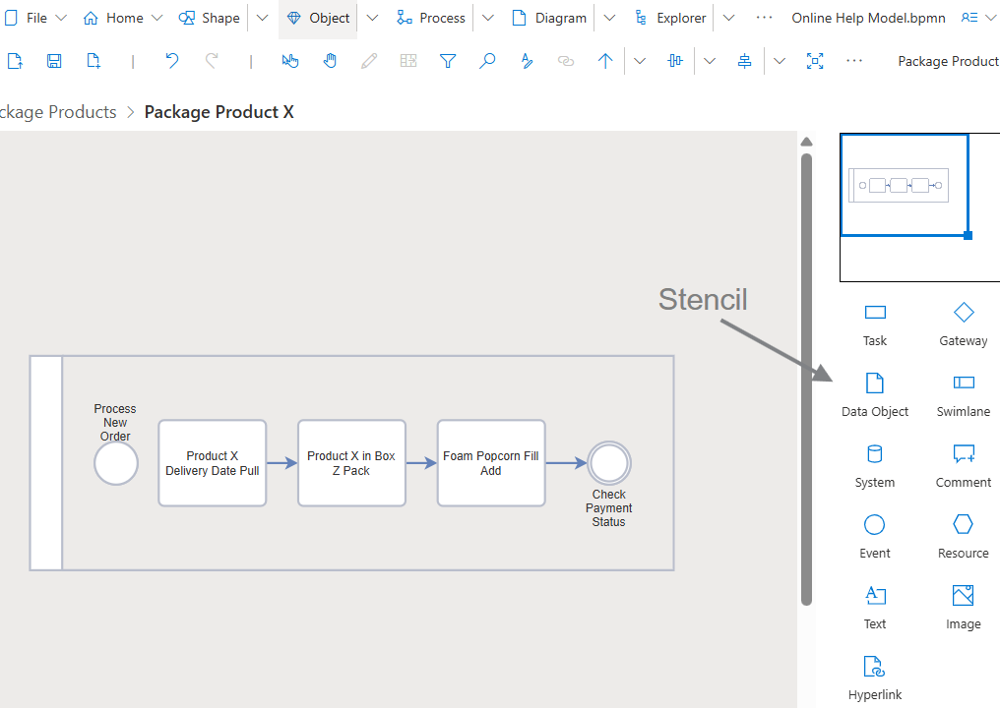
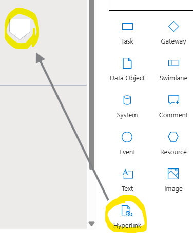
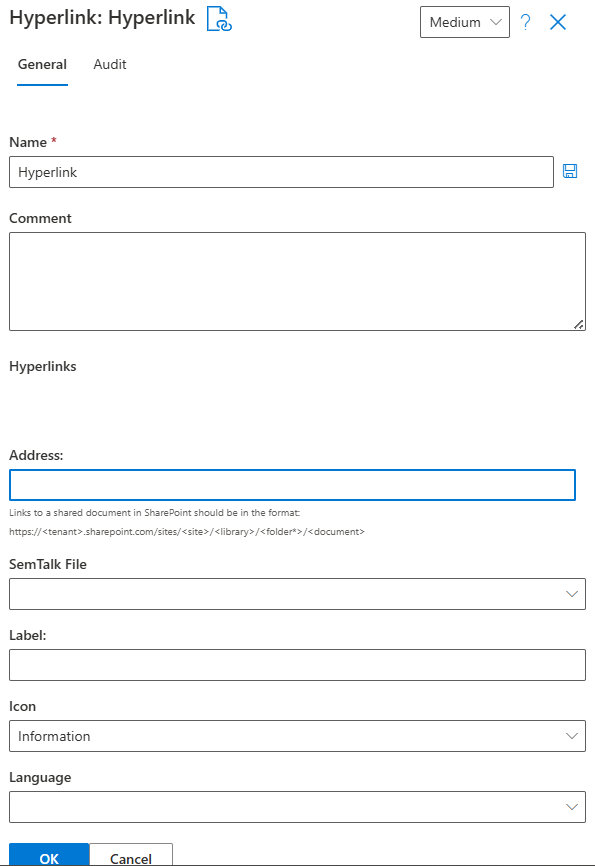
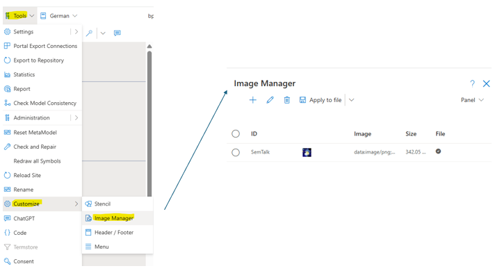
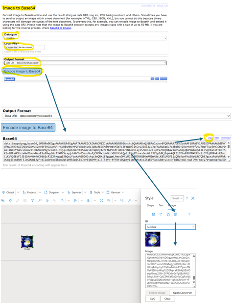
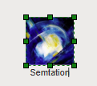

# SemTalk Online and Images

SemTalk Online is designed to allow modelers to add additional visual information to help people quickly understand the information represented in a model. Visual information is comprised of standard representations specific to the selected methodology (e.g. BMPN and EPC standard object representations) as well as additional visual information such as Text, Images and Hyperlinks.

Each Diagram has an associated Stencil with representations of the Objects that can be dragged and dropped onto the active Diagram. Core Objects have fixed Shapes based on the methodology in use but visual characteristics such as color, frame characterists, as well as standard views of what Attribute information should be shown, can be modified as needed. In addition to a Diagram's core Objects; Text, Images and Hyperlinks Objects can also be added from the Stencil to enhance the model's utility. 

NOTE: When inserting Images into a model it is critical to minimize the overall impact on the model's file size. Using Hyperlinks and SVG files help. Before a new image is added, users should always first check to make sure that the Image has not already been uploaded. 

**Ways to Integrate Images:**

**External Hyperlinks:** When it is likely that the same image will be used in multiple models, or in multiple Diagrams, inserting the image onto the Diagrams as image hyperlink is preferable because the image can then be managed from a central file location. Changes, deletions and access restrictions made to the primary image are automatically propagated to all instances of the image in all models that contain the image. Most importantly, external hyperlinks do not affect the size of the model file.

**Embedded base64 Encoded Image Strings:** Objects that need to be permanently integrated into the model file require that the image first be be converted into base64-encoded character strings. 

Please refer to section: 
[Convert images to base64](https://github.com/SemTalkOnline/SemTalkOnline/wiki/image-manager#convert-images-to-base64)

The primary advantage of this method is that the image does not have to be loaded from an external source so it is always immediately accessible to every model user. A disadvantage is that any changes made to the image will not be propagated to the model's other Diagrams or to other models where the object is used. 

NOTE: When inserting embedded images, a model's file size can quickly become large - so large that the model will no longer open. Embedded objects should be used for images that do not change, images specific to an individual model, and/or images that cannot be obtained from a reliable external source.

**As Unique Symbols:** Images that are only used once can be added directly to a Diagrams as a unique image. 

**Image Manager:** Image Manager is an integraded image administration interface that is used to insert images onto a Diagram. Images that are uploaded using Image Manager can be created as unique images/ symbols that are only used on the active Diagram where they were uploaded, or they can be saved as an image file that can be used on multiple Diagrams. This feature allows several modelers to contribute and collectively manage images so that they can be used for all modeling needs. 

# Integrating Hyperlinks Using the Hyperlink Symbol

This option inserts a Hyperlink Symbol onto a Diagram where relevant Hyperlinks can be added.
Hyperlink Image icons are placed on the drawing sheet. After the Hyperlink has been added to the image, users right click on the Hyperlink object to open available Hyperlinks. 
Insert Hyperlinks Objects by dragging  and dropping the Hyperlink object from the Stencil onto the Diagram. 

Then right click on the newly created Hyperlink object and select Properties to add a Name to the Hyperlink object and to add the Hyperlinks associated with the Hyperlink object. Add each Hyperlink by selecting **+ New** and then select **Save** to add the Hyperlink information to the object. 

# Adding Images via the Style Dialog

If an image icon is placed on the drawing sheet, you can open the Style dialog by right-clicking Style (or Menu Icon-->Style). This has an “Image” tab.

Here, you can either specify an external hyperlink or embed an Image file converted to base64. To do this, please refer to the section: [Convert Images to base64](./Image Manager#Convert Images to base64)!

The image can then be embedded into the file.

If a name for the Image is entered in the ID field, the Image created can then also be reused in the formatting dialog of other Image symbols via the selection box labeled ID.

# Image Manager

## Open Image Manager

The image manager is opened via the menu item Tools-Customize-Image Manager.

The window that opens will then list all existing images in the file with their names, contents, sizes, and whether they are already saved in the file.
The menu bar offers a wide range of options for working with images.

## Image Manager Menu List

Here, you can either use an external 
* New (+ symbol): Allows you to create a new image in the image manager
* Edit (pencil symbol): Existing images can be edited
* Delete (trash can symbol): Images can be deleted
* Apply to file: If images are to be embedded in the file, they must first be applied to the file and are then ready for use
* Remove from file: Images can be removed from the file. If they are already in use, the corresponding image shape loses its content. You can see whether an image is saved in the file by checking the “File” column in the overview menu of the image manager.
* Export/Import: The configuration from the image manager can be exported or imported so that a set of images can be easily transferred to other model files
A hyperlink can be specified or a base64-converted image file can be embedded. To do this, please reread the section:

## Working With the Image Manager

Tools-Customize-Image Manager lists all existing images. New images can be created using the Image Manager but those images will only exist in the currently opened Diagram. If the new image needs to be available for all modeling needs, select the “Apply to files” icon in the Image Manager pull-down menu. Only then are the images embedded in the model. 

This ensures that images can first be created and checked before they have any effect on the model file. Images can also be removed centrally from the file by clicking "Delete from file" in the Image Manager pull-down menu.

Images that are embedded in the file have a check mark in the File column. New images can be added or edited using the “New” or ‘Edit’ buttons in the menu bar. An image entry always consists of an ID, i.e., a unique name, and the image content in the “Image” field. This can be either a URL or the base64-converted character string of an image.

If many base64-embedded images are used, keep an eye on the size of the images. The more images that are stored in the model file, the larger the file size. Large files lead to longer loading times. Problems can also arise when exporting the model to a publication database. Because of these restrictions, the file size for export is limited to approximately 10 Mb. SemTalk Online will display a warning message in the Image Manager if the file size exceeds 7 Mb. If you do not intend to export to a publication database, you can ignore the warning.

# Convert Images to base64

Base64 is used to create embedded Image files that are either single-use Images or multi-use Images that can be used throughout the model. Both variants require that the Image first be converted into a base64 string. 

There are two base64 conversion options. The first is the pull-down menu **Tools-Customize-Image Manager-New (+)** that can be used for either single or multi-use Images via the "Apply to file" option. The second option is the **Style-Image**  menu option when a single use Image is used.  

SemTalk Online does not offer its own conversion tool, it uses the freely accessible tool found at https://base64.guru/converter/encode/I. If needed, it is also possible to use other base64 converter tools. 

Before starting the base64 encoding process:
1. Drag and drop an Image Object onto a Diagram
2. Select the object with a single click 
3. Open the **Tools-Customize-Image Manager-New (+)** or right mouse click on the Image and select the **Style-Image** menu for single use Images
4. If you are using the **Image Manager**, give the Image a unique name in the ID box
5. Click on the **Open Converter** button

In the base64 Converter tool:

6. Select **Local File**
7. Set the Output Format to **Data URI-data:content/type.base64**
8. Click on the **Encode image to Base64** button
9. Use the base64 Converter **Copy** button to select all the encoded string
10. Copy the selected string 
11. Paste the encoded string into the **Image box**

 If the process was successful, SemTalk Online will immediately display a preview of the image in the dialog box. 

