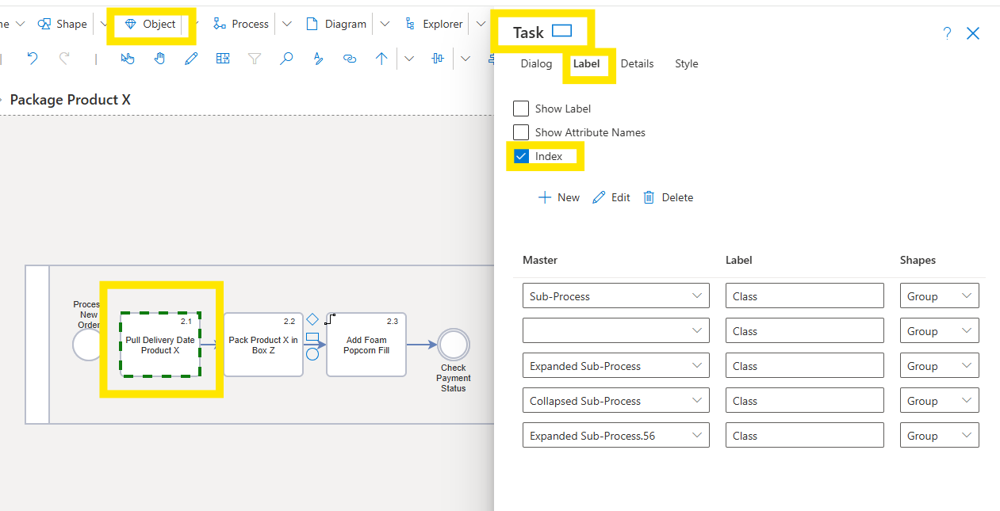

# Index
SemTalk allows **Task Indexing**. When selected, **Index Numbers** are automatically assigned to Tasks and Subtasks as they are created. The default setting is standard numerical nomenclature (e.g. 1, 1.1, 1.1.1). However, since Indices are simple text fields, they can be customized to conform to pre-existing or specialized alpha-nummeric indexing requirements.

Activate **Indexing**:

* Select the first **Task** in your model.
* Select **Object - Customize - Label - Index** from the pull-down menu

**Index Numbers** can be edited on individual Tasks using the **Task - Properties** dialog. 

If **Indexing** needs to change for all connected **Tasks**, select the first **Task** in the model and assign the desired Index number in **Task - Properties**. Then go to the **Process**  pull-down menu and select **Reindex**. 

If **Task Indexing** needs to conform to a prexisting indexing system, just add the alpha-numberic name in each **Task - Properties - Index** menu. 

**NOTE**: If alpha characters are used, the name must include a number at the end of the name to be able to assign Subtasks to Tasks and to show sequencing. 

**Index** numbers are shown in the upper right-hand corner of **Task** Objects. If the **Index** number does not appear, please select the pull-down menu **Tools - Redraw all Symbols**.

