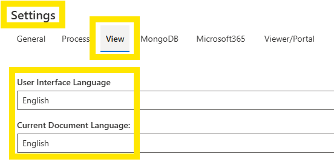
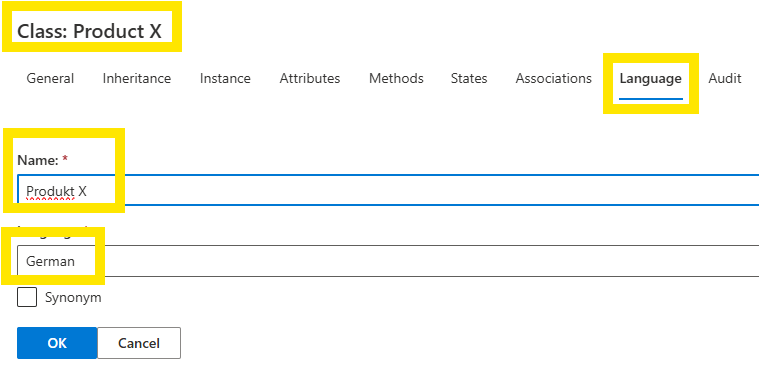
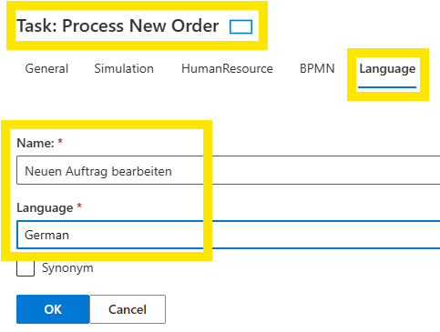

# Language

There are two primary SemTalk Online Language setting types:
* **User Interface Language** to set the GUI language for modelers, and
* **Document Content Language**: to set the viewing language for Model Viewers

When modeling, **Object Names** are automatically mapped to the active model's **Document Content Language**. If you change Languages, newly added Objects are mapped to the model's new **Document Content Language**. **Object Names** retain the **Language** setting that was active when they were created.

If a **Task Name** is changed, it will be assigned to the **Language** settings of the active model. Both the original and the edited **Names** will appear in the **Object List** in the active **Language Pull-Down Menu**. 

**NOTE**: Mapping only occurs if naming is done using the **Vocabulary** naming feature. **Objects** (Nouns) and **Methods** (verbs) are translated separately. 

## Language Menus

* **Settings - View** pull-down menu is used to select SemTalk Online's **User Interface Language** and the model's **Current Document Language**. Those Languages listed in **User Interface Languages** are Languages where basic SemTalk commands are translated and coded into SemTalk, allowing modelers to use SemTalk Online in the **Language** of their choice.

* Select an **Object** and go to **Object - Edit Class - Language Pull-Down Menu**. Users can add additional Object names in other Languages. Select the **+** and add the **Object Name** translation and the Name of the **Language**. 

* **Object - Customize - Language Pull-Down Menu**: If the **Language Checkbox** is selected in any **Task/ Event/ Object Diagram**, the **Language** settings tab will be shown in all **Properties** menus for all **Objects**. This allows users to check and edit **Language** settings for a specific **Objects**

**NOTE** When creating models where the **Current Document Language** settinge will be viewed in multiple languages, it is highly recommended that modelers always use **Vocabulary** when naming new **Objects**. This allows model **Administrators** to create high level language-specific base models using SemTalk Online's **Repository**. High level **Language-Specific Models** can then be used to create language-specific sub-models. This is especially important when process flows vary based on regional requirements.