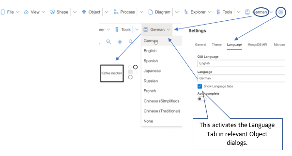
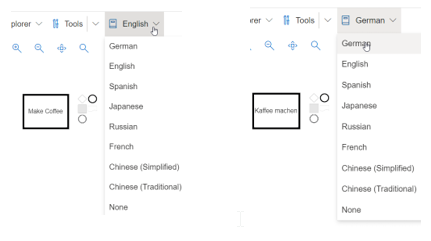

# Language

There are two primary SemTalk Online Language setting types:
* **User Interface Language** to set the GUI language for modelers, and
* **Document Content Language**: to set the viewing language for Model Viewers

When modeling, **Object Names** are automatically mapped to the active **Document Content Language** in the active model. If you change Languages, newly added Objects are mapped to the model's currently selected **Document Contnet Language**. Existing Object Names will retain the language setting that was active when they were created.

If a **Task Name** is changed, it will be assigned the Language settings of the active model. When you reselect the first language from the Language pull-down menu, the Name will change back to the Name it was assigned when the Object was created.

**NOTE**: This mapping only occurs if naming is done using the Vocabulary naming feature. Objects (Nouns) and Methods (verbs) are translated separately. 

## Language Menus

* **Settings - View** pull-down menu: This is used to select SemTalk Online's **User Interface Language** and the model's **Current Document Language**. Listed **User Interface Languages** are those Languages where basic SemTalk commands are translated and coded into SemTalk allowing modelers to use SemTalk Online in their native languages.

* Select Object and go to **Object - Edit Class - Language** pull-down menu. Here users can add additional Object names in other Languages. Select the **+** and add the translated and its Language. 

* **Object - Customize - Language** pull-down menu: If the Language checkbox is selected in any Task/ Event/ Object Diagram, the Language settings tab will be shown in all Properties menus for all Objects. This allows users to check and edit **Language** settings for a specific **Objects**.

**NOTE** When creating models where the **Current Document Language** settinge will be viewed in multiple languages, it is highly recommended that modelers always use **Vocabulary** when naming new Objects. This allows model **Administrators** to create high level language-specific base models using SemTalk Online's **Repository**. High level language-specific models can then be used to create language-specific sub-models. This is especially important when process flows vary based on regional requirements.