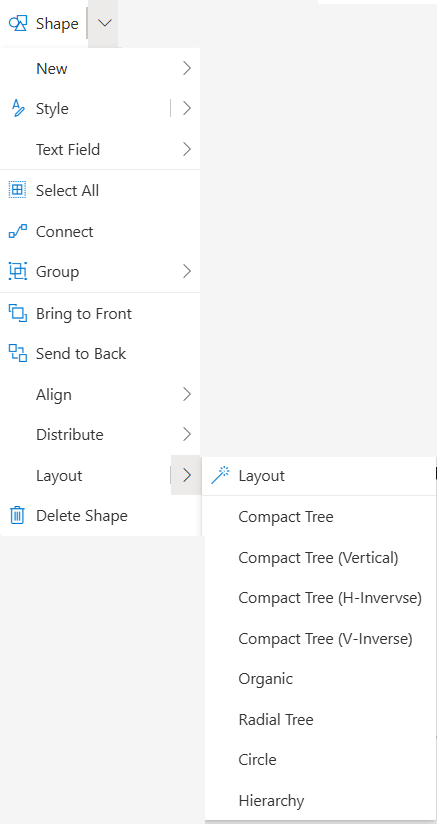
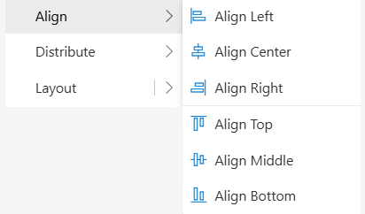
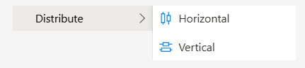

# Layout
 
Various options are put are the user’s disposal in order to help align the various elements in the diagram. These options align the elements in different ways depending on the varied needs of the user. Though the layout options are used for a variety of purposes that include BPMN diagrams, mind maps, etc.

**Align**

Users have the ability to distribute the elements along an axis through selecting a group of elements and then using these choices to align with the element that is the furthest in the chosen option. The elements will then align the furthest side of the of the furthest element of the chosen side. 
(All elements changing position are categorized as individual actions and the undo and redo buttons only change the position of one element at a time)

- Align Left: the grouped elements align with the furthest element on the left and the left side of the element
- Align Right: the grouped elements align with the furthest element on the right and on right side of the element
- Align Center: the grouped elements align to the center of the selected elements using the furthest center of the element on the left 
- Align Top: the grouped elements align with the furthest element on the top with the top side of the element
- Align Bottom: the grouped elements align with the furthest element on the bottom from the bottom side of the element
- Align Middle: the grouped elements align with the element situated on the left of the grouping from the middle of the element

**Distribute**

Distribution is used to create standard spacing between the selected elements and should be used periodically as it can be chaotic when used with a large amount of elements.

 
Distribute Horizontal: Creates standard spacing on a horizontal plane with selected elements using the space between the left and right most elements

Distribute Vertical: Creates standard spacing on a vertical plane with selected elements in a given area between the elements on top and bottom of the selected grouping
