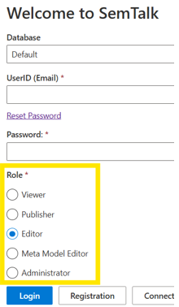

# Login

SemTalk Online requires a UserID (user's e-mail address) and a password. If you already have an account, select your User Type and login. When SemTalk opens, either your last used model will appear or a new model will open that corresponds to the model type used the last time you logged in. Unless instructed to access a specific customized Database, leave ‘Default’  as your Database.  If you have been instructed to access a particular Database, select the Database from the Database pull-down menu. 

If you forgot your login password, enter your email address and select the Resend Password option and you will be sent a temporary new password. After you login, go to the Tools - User pull-down menu and create a new password.

SemTalk Options are based on your selected role.

 **SemTalk Roles:**

**Viewer**: Users are able to **View**, but not edit or create models. The majority of end users have this **Role** so that they can view and understand defined process flows.

**Publisher**: This role is able to publish process models for process portals.

**Editor**: Users are able to **Create** and **Edit** new and existing models. This is the standard **Role** for members of the modeling team.

**MetaModel Editor**: Users are able to **Edit** the model as well as customize the **MetaModel Class** components to meet organizational naming and object structure requirements. MetaModel editors require additional knowledge of SemTalk's Object MetaModels and their associated notational structures.

**Administrator**: Users can perform all SemTalk Online Roles; add, delete and edit **Users and User Roles**, and they can customize the overall **User SemTalk Online Interface**. The **Adminstrator Role** should be used with caution as this Role can change the modeling environment and available content for the Model Viewers and Editors. Only those with extensive SemTalk Online knowledge should be assigned the Administrator Role. 

The **Connection** button can be used to specify another (own) MongoDB server. This way you can also access your own databases via the SemTalk Online application.

