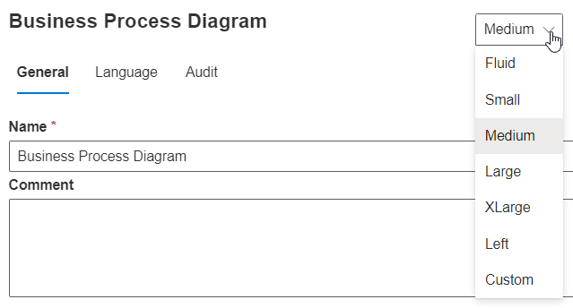
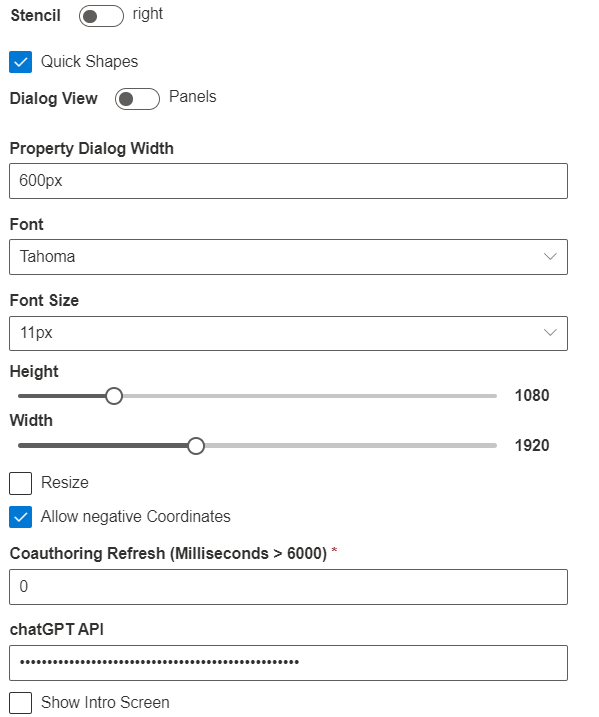

# Menu Size & Placement Options

SemTalk Online allows users to customize the size and placement of their **Diagram**, **Object**  and **Stencil** Windows. This makes it easy to customize the SemTalk Online interface based on use case scenarios. Fewer menu itens make it easier to see process workflows. In reverse, it is easier to read menu options if certain windows are made larger.

Click on an **Object** and select **Properties**. In the upper right corner or the Properties window is a pull-down menu with the size settings. The default is **Medium**. When **Small** is selected, the menu becomes narrower leaving more room to view the current **Diagram**. When **Large** is selected, the focus shifts to the **Object Menu** and less of the **Diagram** is visible. 

**Panels:**
It is also possible to switch shown panels to the left or right of SemTalk Online workspace. Go to the **Diagram - General** menu to show which side to place the **Properties** panel, **Stencil** or **Pan & Zoom**.

Panel sizes are customized using the **Settings - General** tab. Here you can also adjust the size of your GPTChat Panel using the Property Dialog Width.

