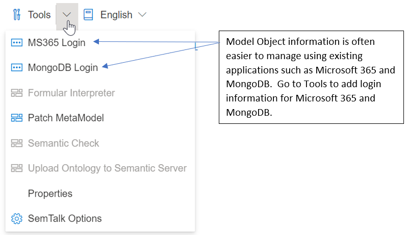

# Microsoft 365 and MongoDB Login

## Login / Registration
Registration is only required if MongoDB is used. Users that use SemTalk Online in Microsoft 365  will not need to register accounts or use a seperate login.

For additional information: [Microsoft 365](https://github.com/SemTalkOnline/SemTalkOnline/blob/7960078a3c8087b72370f336fec45b3cf4d39870/SemTalk-Online-in-Microsoft-365.md)

