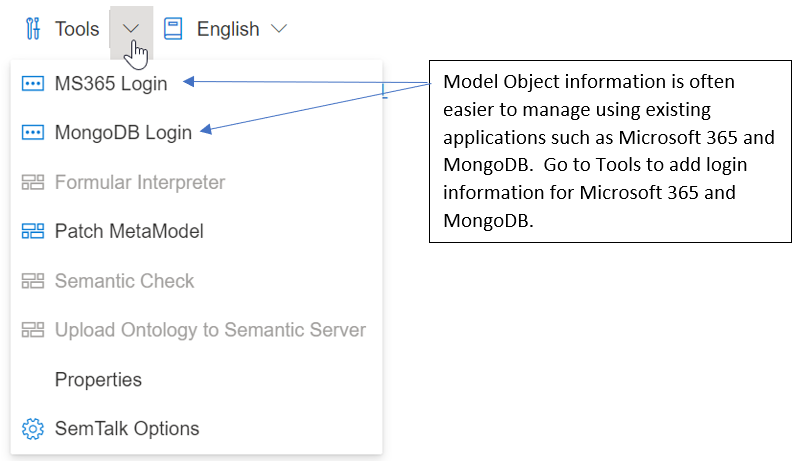

# Microsoft 365 and MongoDB Login

## Login / Registration
Registration is only required if MongoDB is used. Users that use SemTalk Online in Microsoft 365  will not need to register accounts or use a seperate login.

For additional information: [Microsoft 365](https://github.com/SemTalkOnline/SemTalkOnline/wiki/Microsoft-365-and-MongoDB-Login-Tool)

