# Navigation

Model Navigation Tools Include:
* Breadcrumbs,
* Search,
* Explorer,
* Select,
* Arrows,
* Pull-down Lists: Between Diagrams or Objects Within Diagrams,
* Refine & Go Up, and
* Navigator Tool

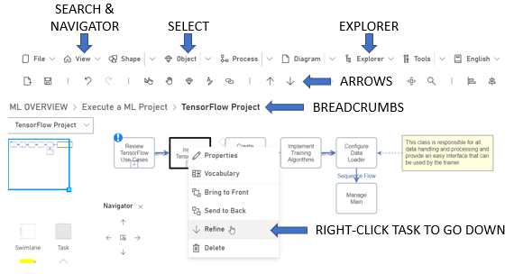

**Breadcrumbs**:

Breadcrumbs are one of the main navigation tools for navigating through various Diagrams. They are the overview of where the currently active Diagram is within your model. When you click on a higher level Breadcrumb, you will go to that Diagram. Clicking on the arrow next to highest level Breadcrumb will present a clickable list of all of the Diagrams in your model. 

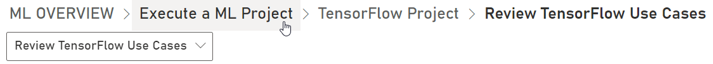

**Search**:

Search is used to find Objects that contain your search term. Results will be shown as a table of where this term is used in each Object type.

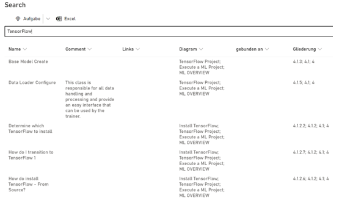

**Explorer**:

The Explorer is able to access and edit all Objects. Find an Object by selecting it from its Object type. Select your Object from the list. After selection, all attributes of the Object will be shown.

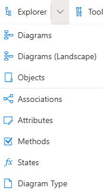

**Select**:
Select is used to change a particular system or resource to a different system or resource. Select a system or resource and use the Select command to open a resource or system picklist. When you select the desired system or resourse, it will immediately change in your model.

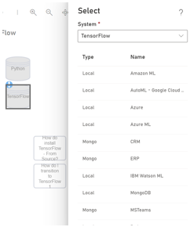

**Between or Within Diagrams**:

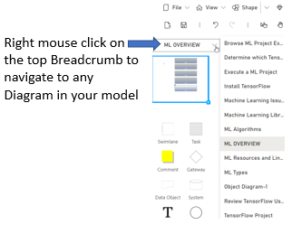

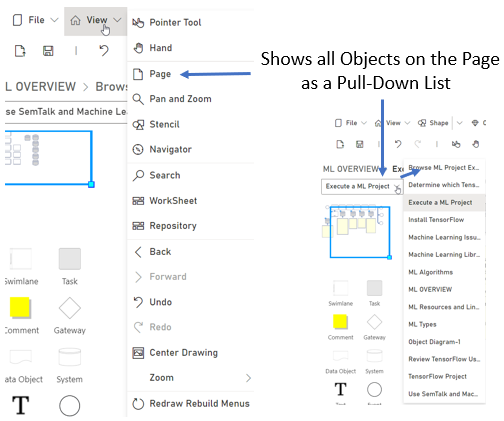

**Arrows**:

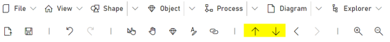

Arrows are used to navigate between higher and lower-level Business Process Diagrams. The up arrow goes to the higher level and the down arrow will either take you to the Refinement of the object or if there is not a Refinement, it will create a new Refinement of the Task.

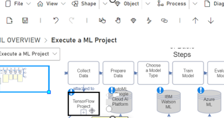

**Refine (Go Down) & Go Up**:

Navigation in Models with Refinements uses the Properties - **Refine**, and Properties - **Go Up** commands.

If you right-click on a Task Object that does not have a Refinement and click **Refine,** a Refinement Diagram is automatically created and opened. The new Refinement will include a Swimlane that contains an Event Object that triggers the new Refinement process flow. Use the **Go Up** command to return to the higer-level Diagram. 

When you right-mouse click on a Task that has a Refinement, **Refine** will open the Refinement Diagram for that Object. **Refine** is the equivalent of a Go Down command. The Arrow keys provide the same function. If you click on the Down Arrow over a Refined Task, it will navigate to the Refinement. In reverse, if you are in the Refinement and click an Up arrow, it will take you to the higher-level Diagram.

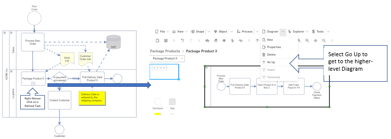

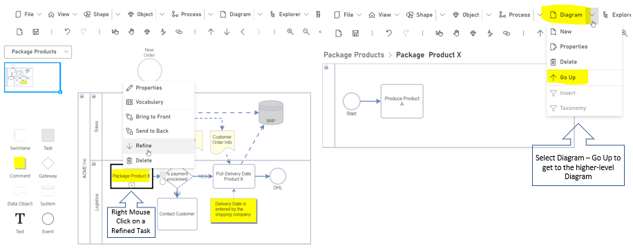

**Navigator Tool**:

When it is difficult to physically walk through a process flow, the Navigator tool reads out-loud the Task Object’s name. The Navigator arrows shown how the process flow should be read. Up and down reads the between Refinements and higher-level processes and left and right reads the process flow forwards or backwards on the current Diagram. 
