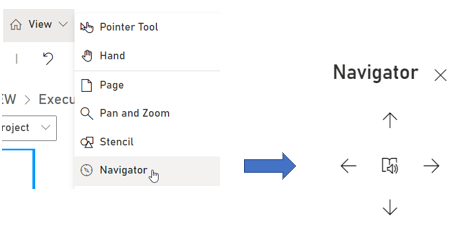

# Navigator Tool

When it is difficult to physically walk through a process flow, the Navigator tool reads out-loud the Task Object’s name. The Navigator arrows shown how the process flow should be read. Up and down reads the between Refinements and higher-level processes and left and right reads the process flow forwards or backwards on the current Diagram. 