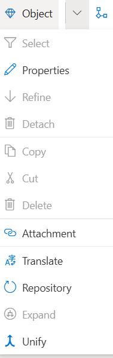

## Object Pull-Down Menu ##

Object are managed in the Object Pull-Down Menu.

**Select**: Opens a picklist of all available Objects

**Properties**: Opens the Properties window for a selected Object.

**Refine**: Refines a selected Task Object.

**Detatch**: Detatches the Refinement of a selected Task Object

**Copy**: Copies a selected **Object** so that it can be pasted on allowed **Diagrams**.

**Cut**: Removes the selected **Object** but does not delete the **Object** from the active Model.

**Delete**: Deletes the Object from the **Model**.

**Attatchment**: Opens the Object's Attatchment dialog and allows users to add, delete or edit Attatchments. 

**Translate**: Opens a dialog that allows users to add translations of the Object Name into other languages.

**Repository**: Allows users to select Object names from the Organization's core Object Repository. 

**Expand**: Allows users to select Objects that are associated with the selected Object in other Diagrams.

**Unify**: Allows modelers to consolidate Objects that are synonyms or closely related to the selected Object.

