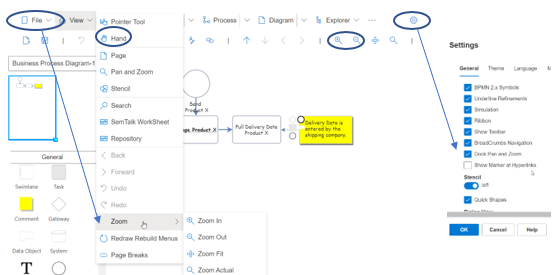

# Pan & Zoom

The Zoom window is designed to help users navigate to different parts of their Diagram. 

The Zoom window is turned on and off by selecting or deselecting it in the View - Pan and Zoom pull-down menu. 

The Pan and Zoom window can also be undocked from your window by going to SemTalk Settings (the gear box setting on the top right of your SemTalk window) and unselecting Pan and Zoom.

NOTE: Users with smaller laptops may have difficulties when trying to view different parts of their Diagrams. Make sure that your Zoom window shows your model elements in the top left corner of the Zoom Window. You may also need to use the Zoom + / - buttons to make your Diagram objects smaller. Additionally, users can select the hand button to move to different parts of their diagram.