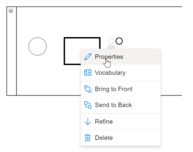
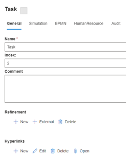

Right-click on an **Object** to select **Properties**.

Default settings for **Properties** tags are based on:
* SemTalk version selected, 
* **Object** type selected, and 
* Modeling rules set by the modeling project team (tab menues are customizable and tabs can be turned on an off depending on modeling requirements). 

The following example is for standard **Properties** for a Task. Regardless of the SemTalk modeling environment being used, or the **Diagram** type selected, general principles for **Properties** remain the same.

**Properties - General** (Default settings for a **BPMN version** **Task** in a **Business Process Diagram**):

**General - Name**: **Object** names must consist of letters and numbers. Other characters (e.g. periods, slashes, underscores, colons, etc.) are not allowed. 
When you name an **Object**, after dragging and dropping it onto a **Diagram**, the name you gave the Object will automatically be added to the **Properties** Name.

**General - Index**: This is the Task Index number for the Object as it related to other Task Objects. SemTalk automatically assigns an Index number but this number can be edited to correspond existing organizational indexing numbers.

**General - Comment**: Comments can be added to Objects. Connect the Comment Object to the Task that contains a Comment to see the Comment on your Diagram.

**General - Refinement**: 

In Business Process Diagrams, Tasks can be broken down into Subtasks using the Refine or Refinement command. When you select Refinement in a Task right-click menu, a new Business Process Diagram will be opened that is linked to the higher level Task. The newly created Diagram will automatically be given the name of the Task that is being refined. The Properties - Refinement command allows you to Create, Delete or Edit Refinements.

General - Hyperlinks: Internal and external Hyperlinks can be attached to Objects.

**Simulation**:

* BPMN,
* HumanResource, and
* Audit

**Vocabulary** naming option
SemTalk structured naming convention for naming Tasks is found by useing the right mouse click Vocabulary . Almost all processes (work-steps) have names that consist of a verb and a noun. For example, the process step 'Send Invoice' is the verb 'Send' and the noun 'Invoice'. SemTalk allows users to create libraries of these verbs and nouns so that all modeling projects remain consistent; interfaces that define information flows remain consistent; and so that central repositories of terms can be created that allow modelers to import/ export key data terms to and from these libraries.

Right-mouse click on a new Task and select Vocabulary.

