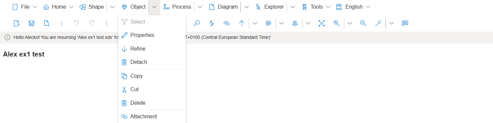

**Refine**

**Refine** is used to break **Tasks** into **Sub-Tasks** in **Business Process Diagrams** making it easier to visualize and understand graphical process flows.

Users create Refinements (sub-process workflows) by right-mouse clicking on a Task or by selecting a Task Object and selecting the **Object- Refine** option. Refine opens a new Diagram that is automatically named after the Task that is being Refined. Refined Tasks are visible because the Task is either underlined or the Task Object has a plus sign depending on the user setting selected in SemTalk Option - General menu setting.

Users open the Refined Task Diagram via the Diagram Label menu. 

Detach a Refinement by selecting Detach from the Object pull-down menu.

