# SemTalk Object Repositories

SemTalkOnline's **Repositories** are database libraries that contain predefined **Task Objects** with their associated information, such as **Object Name, Methods, States, Attributes and HumanResources**. **Repositories** are used to create default picklists for modelers as they document process flows. **Repositories** can easily be updated and improved as new organizational modeling projects are added or as modeling teams identify missing information.

**Repositories** are not mandtory but the use of a shared **Repositories** streamlines process documentation, increases collaboration, decreases redundencies and improves the overall quality and value of process documentation projects.

**Repositories** are created by Model **Administrators** to create a standardized vocabulary for use by the entire modeling team. 

Teams use the Vocabulary option to name   **Tasks** by selecting **Objects** (Nouns), **Methods** (verbs) from the Repository picklist. Or, when naming Events and Gateways, modelers select **Objects** and **States** from the **Repository** picklist.

If Objects are not in the picklist, it is possible to integrate the **Repository** so that as new **Objects** are created, they can be uploaded into the **Repository** for use in all modeling projects. 

Additional information can be found at: [Wiki page: Vocabulary](https://github.com/SemTalkOnline/SemTalkOnline/wiki/Vocabulary) or [Wiki page: Working with objects](https://github.com/SemTalkOnline/SemTalkOnline/wiki/Working-with-Objects).

## **Repository Content**

The Repository contains:
* **Objects** (nouns): These are the concrete part of a Task such as 'Invoice'
* **Methods**: The verbs that are used with their corresponding **Object**. For example, the **Object 'Invoice'** is linked with the **Methods 'Create'** and **'Send'**.
* **States**: Show the status of an Object. For example,**'Invoice Sent'** is the **State** of the Invoice. 
* **Attributes**:  Characteristics associated with an Object. For example, **'Invoice'** is **'Greater than $1000'** 

* **Organizational Roles**: These are the people, roles or groups who perform the process flow **Task**. For example, **'Create Invoice'** is performed by the **'Accounting Department'**. 

The **Repository** uses the following descriptions for **Organizational Units**: 
  - **Role** (HumanResources) 
  - **HumanResource** (HumanResource)
  - **Person** (HumanResources)
  - **Position** (HumanResources)
  - **OrgUnit** (HumanResources)

## Setting up a Repository

**Repositories** can be hosted in either **Microsoft Sharepoint** or in a **MongoDB** database. Different steps are required for each **Repository** type. 
If semtalkonline.semtalk.com is used, a **Repository** is already integrated and the setup steps are not needed.

### Setting up a SharePoint Repository for SemTalk Online in Microsoft365

**Microsoft365 Repositories** are stored in a **SharePoint** site that is integrated with **Microsoft Teams** and SharePoint. 

Users must have **Administrator** privileges to set up a new **Repository** and to be able to create **SharePoint Lists** on existing **SharePoint Sites**.

Open SemTalkOnline **Settings - Microsoft365 - Create Repository**
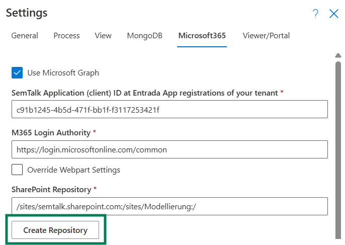

A dialog box will open that shows the **SharePoint List** that will be created on the selected site. Select the **Sharepoint Document Site / Teams** from the available pull-down list of **SharePoint Sites**, and then selelct **Create Repository**. SemTalk Online will create all of the Lists on the chosen site. SemTalkOnline **Repository** is then integrated into Microsoft365. Users will login to SemTalkOnline using their **Microsoft 365** account.

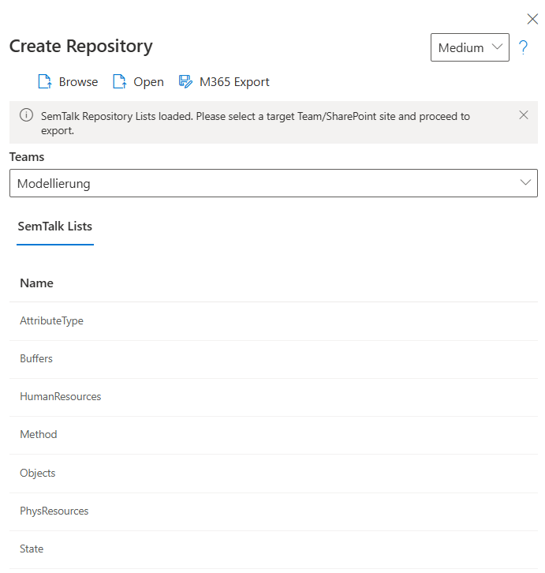

The created **Repository** needs to be configured in SemTalkOnline **Settings**. Open SemTalk **Settings - Microsoft365 - Repository**. The specific location of the **Repository** needs to be specified to be able to access it via **Microsoft Graph**.

* * /sites/<domain>.sharepoint.com:/sites/<sitename>:/ * *

Add your ogranization's domain name, along with the selected site name, to the template string and add it to the field **Repository**.

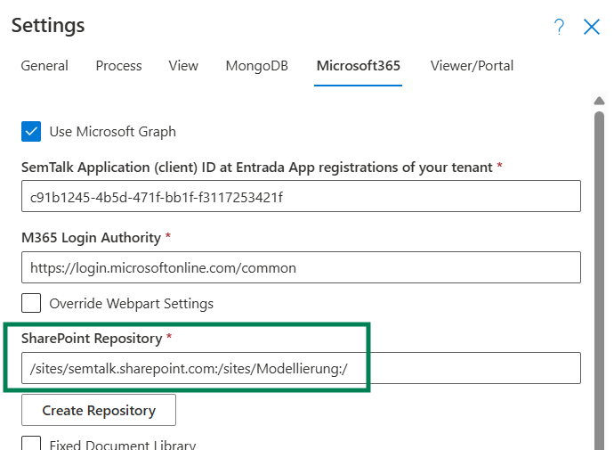

### Setting up a Repository in MongoDB

## Using the Repository

### UI and functionality of the Repository

Open the Repository using the **Home - Repository** command.

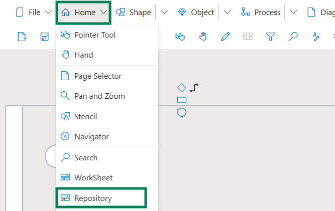

Initially the **Repository** will be empty and should appear as shown below.
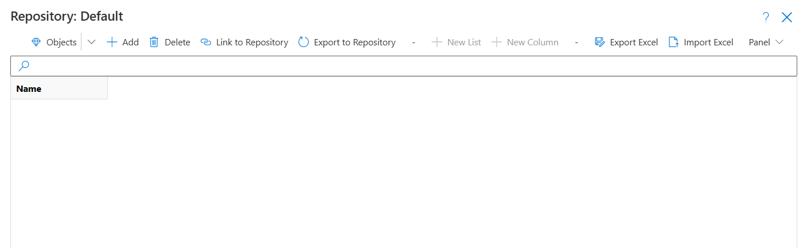

This menu shows multiple options to view or extend the **Vocabulary** of the **Repository**.

* **Objects**: Shows a list of the available types of **Objects** in the model such as - Business Objects, Human Resources, Buffers etc.** Select an **Object** type to open a table that will show all Objects of the selected type that are stored in the **Repository**.
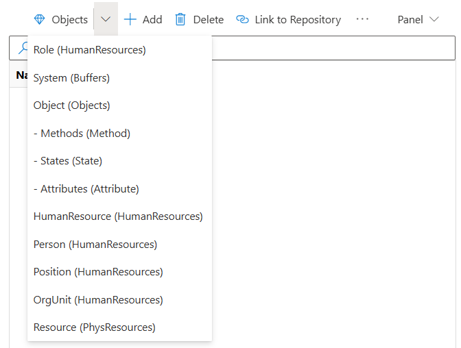

* **+ Add**: Adds **Objects**  into **Repository** via the **Object** Type selected from the **Object's** pull-down menu. If the **Object** is used in the current model, select the name from the Name pull-down menu. If the **Object** is not in the opened model, Add the new Object Name and select  OK.
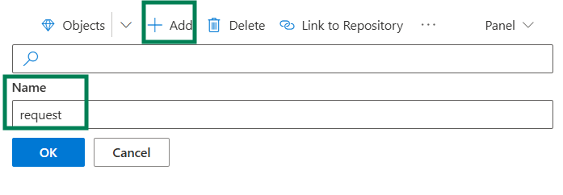
Afterwards the new **Object** will be inserted in the **Repository**.
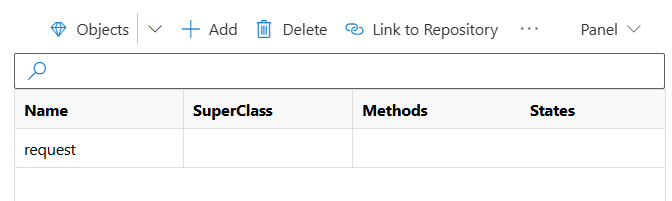

* **Delete**: Deletes Objects from the Repository. Users select one or more Object Names and those Objects will be deleted from Repository but not from any of the model files where the Object has been used.

* **Link to Repository**: Links Objects that are used in both the Repository and in the opened Process Model to avoid redundencies.

* **Export to Repository**: Exports all Objects from the opened Process Model into the Repository. **NOTE**: If duplicate Objects have not already been **Linked to Repository**, redundencies will occur!

* **New List**: Adds new elements to a Repository when additional elements are needed. This functionality is only available for users with Administrator privileges.

  - **New Column**: Lets users create more columns for existing lists. This functionality will only be for users with admin permissions.
  - **Export Excel**: Exports Repository ojects to an Excel file
  - **Import Excel**: Imports an Excel file and creates Repository objects out of the providied data

### Using Repository Objects in Process Models

Consider the following scenario:

The following Repository consists of a limited number of Objects, Methods and Roles.

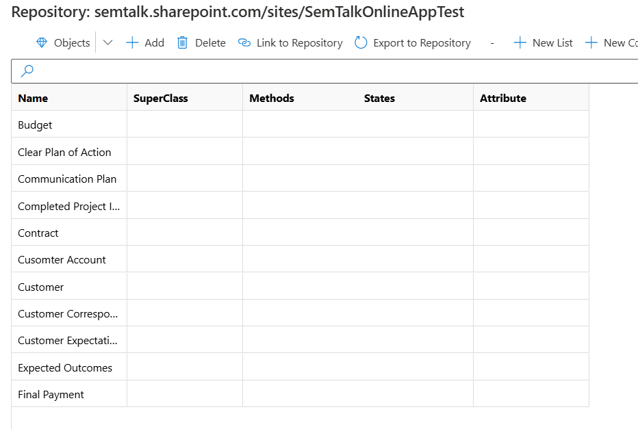
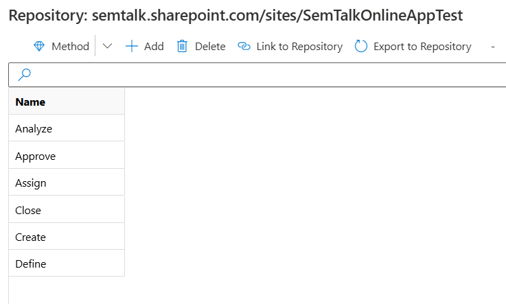
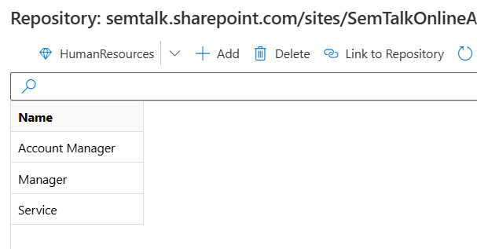

Now we will use Repository Objects in a new BPMN Business Process Diagram. Drag and drop a Task Object onto a Business Process Diagram. Right mouse click on the new Task and select **Vocabulary**. A new menu will open that shows Objects, Attributes and Methods. All available Repository Objects, Attributes and Methods in the Repository will be shown in each of their pull-down menus. 

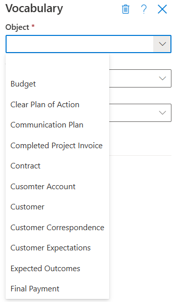

The **Vocabulary** menu is also available for Events and Gateways where users select Objects and States instead of Objects and Methods.

**Roles** access the Roles in the Repository using the Role's right mouse click **Select** menu. In BPMN this is the **Swimlane**. 
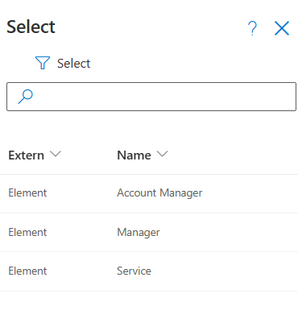

Additional information about Objects: [Wiki page: Working with objects](https://github.com/SemTalkOnline/SemTalkOnline/wiki/Working-with-Objects).

### Editing Objects and Refreshing Model Content

Edit Repository Objects names directly in the Repository spreadsheet. 
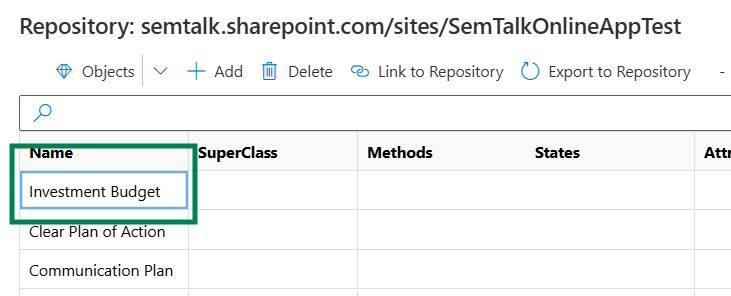

**NOTE:** Edits made directly in the Repository will not be automatically propogated to the Objects in the Process Model. Users must select the Object and then use the **Object - Repository - Refresh** pull-down menu to Refresh the Repository.
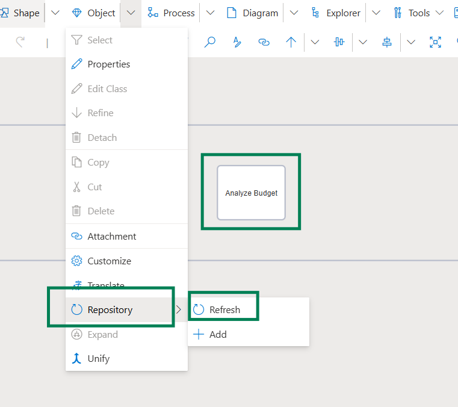
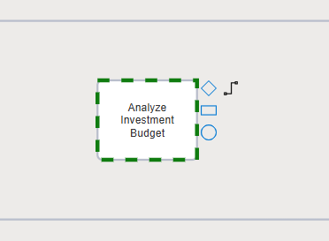

