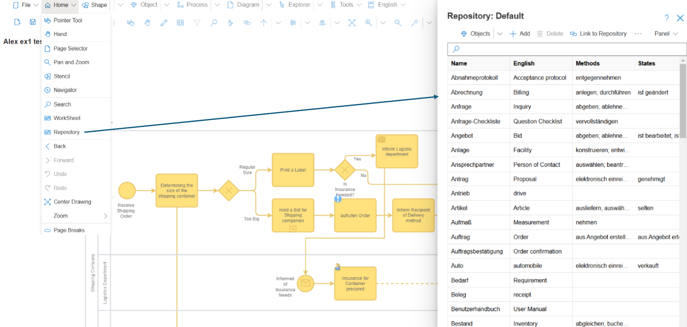

**SemTalk Object Repositories**

Repositories are the SemTalk database libraries where the names of Objects, Methods, States, Human Resources and Attributes are managed. 

Repository modeling objects are designed to keep model data consistent because Users insert predefined objects from picklists that they use when modeling. As they add new objects into their models, they can be added to this Repository using the **Tools-Export to Repository** tool. 

Repositoiries can be managed within SemTalk or they can be integrated with Microsoft Sharepoint or MongoDB databases. 

Repositories can be chosen when logging into SemTalk or users can select the Repository from the Repository pull-down menu.

When you open the SemTalk Default Repository, SemTalk will open the last used Repository.

Use the Home pull-down menu to access and modify your Repository. 

Use the Repository Export Excel command to view the entire Repository content. Open the exported Excel file to view the Object names and their associated individual entries. Users can add and edit Object data in this Excel file and then use Import Excel command to propogate the changes back into your Repository. 

New objects can be imported into the Repository using the **Tools-Export to Repository** pull-down menu command.  

