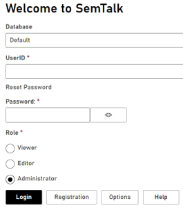

# SemTalk Online User Roles

Role settings are selected during SemTalk Online login to assign a Role to the user. 

 **Viewer**: Users are able to view, but not edit or create models. Most users will simply be viewing exiting models and when logging in, they should select the Viewer role. 

 **Editor**: Users are able to create and edit new and existing models. This Role is for the modeling team.

 **Administrato**r: Users are able to create and edit new and existing models and they are able to customize the SemTalk GUI. The Adminstrator Role should be used with caution as this role can change the modeling environment for the Model Viewers and Editors. Only those with extensive SemTalk Online traning should select the Administrator Role.