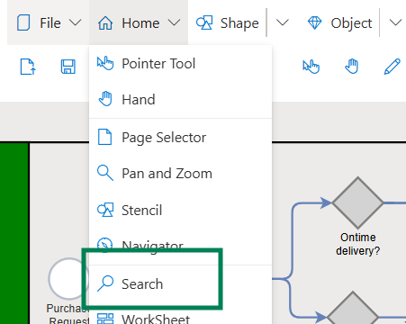
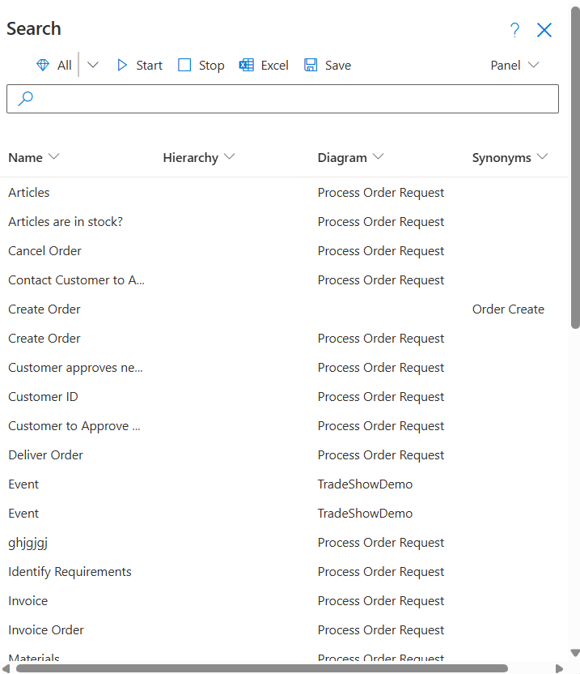
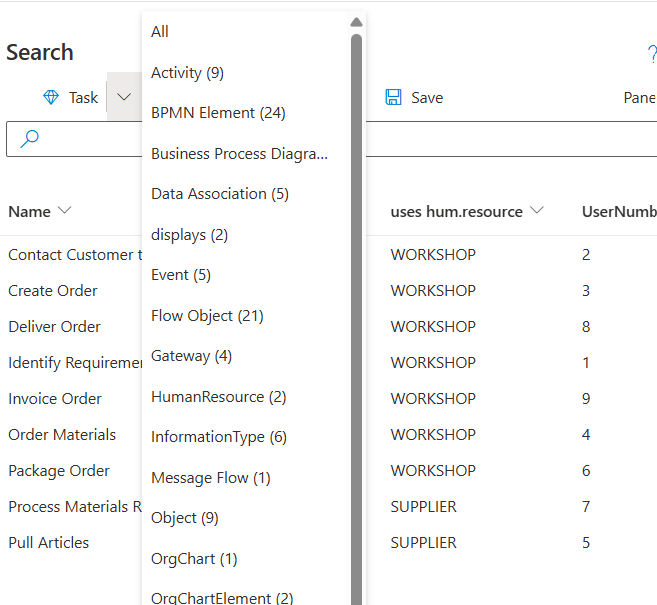

# Search

**Search** is used to find Objects that are used throughout the model. Search is paticularily helpful in models with many Diagrams or when searching for specific Tasks, Events, or Gateways.

Select **Search** from the  **Home** pull-down menu to open the **Search Dialog**.

If users **Select** an **Object** on the currently opened Diagram, **Search** automatically searches for all Objects in the opened model that contain the same **Name** as the selected Object. 

If no  **Object** is selected, users enter a **Search Term** or click on one of the shown  **Search Term Object Names**. Search will show all Objects that contain the entered or selected Name.

## Using Search

Objects matching the **Search Term** will be shown in a Table that consists of:
* **Object Name**, 
* **Diagram Name** and 
* Additional **Attribute Data** depending on the Object type selected. 

1. Click on the **Column Header** to sort and filter content.
2. Click on the **Search Term Row** to navigate to the associated Diagram. The selected Object will be highlighted with a **Blue Frame**. Users can then easily navigate through the found Objects and/ or jump to the place in the process model where the Object is used.
3. Use the **All** pull-down menu in the top left of the **Search** window to filter **Objects by Object type**.  This  shows all Object classes in the model. If an Object type is selected, only those objects belonging to that Class will be shown. (e.g. Tasks or Events)

4. Search for a **Specific Term** by entering the word into the Search dialog box.
5. **Start** and **Stop**  trigger a new search or stop the current Search.
6. **Excel** exports a list of found Objects to an Excel file.
7. **Save** writes found Objects items to a JSON file.
8. **Edit the Object Name** of a found Object, by double-clicking on the row in Search where the Object where it is shown. The Object will be shown in the Diagram where it is used and the Object's Property window will open. 
- If the Name was not created using the **Vocabulary** option, simply change the Name and click on the Save icon.
- If the **Object Name** was created using the **Vocabulary** naming option, change the name by selecting the **Vocabulary Icon** shown to the right of the Object Name. Enter the the desired **Vocabulary Object and Method Names** from the current Repository or create new Object and Method Names as needed. 
