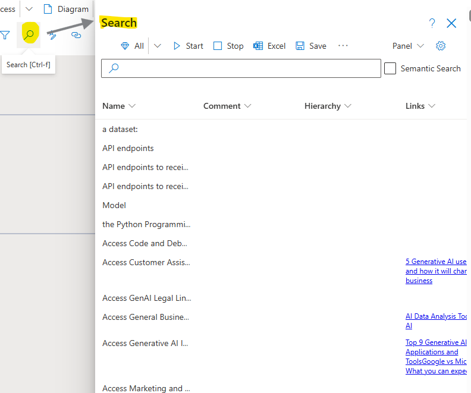
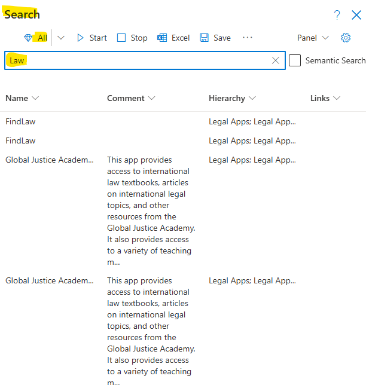

**Search**

Search is used to find Objects that are used throughout the entire model. This is paticularily helpful in models with a large number of Diagrams or when searching for specific Tasks, Events, or Gateways.

Search will open all of the places (e.g. Diagrams, Comments and Links) where the Search Term is found. 

