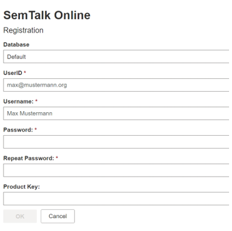

# SemTalk Login

****Registration****: First time users must complete the Registration form. 

The Database option selects the LogIn account type for SemTalk Online. 

Databases types are:
* Default - General accounts via SemTalk Online, 
* Existing accounts, such as their Microsoft account, or they can 
* Access a their personalized accounts via their MongoDB Database. 

The associated Repository contains the library of existing SemTalk Objects available for you to use in your model. As you model, new objects will be added to your Repository. Unless instructed to access a specific Repository, leave ‘Default’  as your Repository.  If you have been instructed to access a particular Repository, select the Repository from the Repository pull-down menu.

**[Role](https://github.com/SemTalkOnline/SemTalkOnline_EN/wiki/Role)**: Select your modeling role

*  **Viewer**: Users are able to view, but not edit or create models. 

*  **Editor**: Users are able to create and edit new and existing models.

*  **Administrator**: Users are able to create and edit new and existing models and they are able to customize the SemTalk GUI.

**[Options](https://github.com/SemTalkOnline/SemTalkOnline/wiki/SemTalk-Settings)**:  Options are used to select general settings, GUI and modeling languages and to manage interfaces. 
