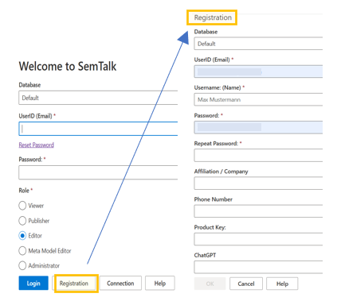
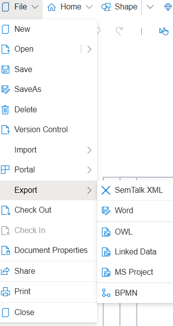

# Brief Tutorial

**Login/Registration**

Database and repository can be custom built for the customer if desired.

**Roles**:

* Viewer = Read-Only mode
* Editor = Modeler
* Meta Model Editor
* Administrator = Customization of the GUI

Interface can be customized via options in language and layout.

**Registration**
* UserID = E-Mail
* Username = Name Shown
* Passwort = User-Defined Password
Key is left blank when using the Demo version 

**Viewer Role Interface**:

* Able to view models and properties of objects
* Export as Word, HTML, PNG and JPG

**Open New Model**

* File = Open or export models
* Open = Models can be opened from the hard disk or from the database. Models from the database are displayed as the default.
* Model is shown with status information (e.g. date modified, who modified, and current status).

  - Export: Word, HTML, PNG, JPG, Image File (SVG)
  - Print Preview = Print via WebBrowser
