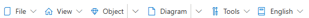
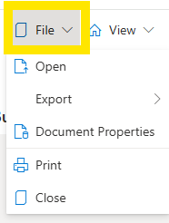
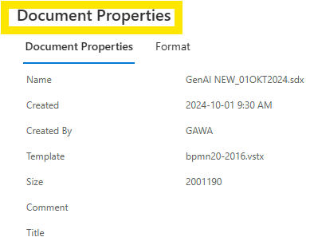
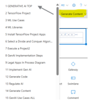
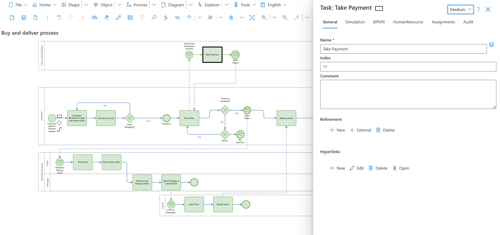

# SemTalk Online - Introduction
Stand: November 2025

## General Information

SemTalk® Online is a Business Process Modeling and Ontology Editing tool designed to manage process knowledge, both in terms of workflows and in terms of identifying and providing metadata for documents and other content-related needs such as Portals and Smart Forms.

## Login/Registration

<picture>
  
</picture>

- **Databases** and **Repositories** can also be custom built. 
- Roles: 
  - **Viewer**: Read-Only mode 
  - **Editor**: Modeler 
  - **Administrator**: Customization of the GUI 

A subset of the user interface can be customized via options in **Language** and **Layout**. 

## Registration

<picture>
  
</picture>

- **UserID**: User E-Mail 
- **Username**: The name shown in SemTalk Online 
- **Password**: User-defined password 
- **Key**: If a **Demo Version** is being used, Key should be left blank

# User Interface

<picture>
  
</picture>

## Viewer User Interface

###  Viewer Pull-Down Menus
  

###  Viewer File Pull-Down Menu

  

- **File**: Opens or export models 
- **Open**: Models can be opened from the Database or from local file drives
- **Export**: Exports the model to Word, HTML, PNG, JPG, or as an Image File (SVG) 
- **Document Properties**. Shows status information 

  

- **Print**: Prints file 

## Navigating to Other Diagrams

  

If a model has mutilple **Diagrams**, users can navigate to other **Diagrams** via the pull-down menu located to the far right of the **Icon Menu**. The name of the active **Diagram** will be shown. Click on the current **Diagram's Name** to open a pull-down list of all the **Diagrams**. Click on the **Diagram's Name** to open the Diagram.

## Additional Viewer Pull-Down Menus

- **View**: Navigation to other pages and **Pan and Zoom** functions

- **Object**: Lists **Objects** with their **Properties**, **Attachments & Hyperlinks** and **Refinements**

- **Diagram**: List of Diagrams with navigation arrows
   - **Diagrams**: Displays the model’s **Navigation Tree** 
    **NOTE**: Users can navigate to other Diagrams from here.

- **Tools**: 
  - **Settings**
  - **Simulation**
  - **Navigator**
  - **Statistics**
  - **Report**
  - **Worksheet**
  - **ChatGPT**
  - **Redraw All Symbols**
  - **Reload Site**

- **Language**

# Editor User Interface

Model **Editors** have all of the **Viewer** commands plus all active modeling funtions.

<picture>
  
</picture>

**Stencil**: Contains shapes that can be dragged and dropped onto the active **Diagram**. 

**NOTE**: The shapes shown are specific to the active Diagram. 

 Workspace layout and modeling functions are in the **Pull-Down** menus, **Icon Menu**, **Settings** or via selected **Object** menus.  

## Editor Pull-Down Menu

SemTalk Online's primary modeling commands are found in the pull-down menus.

- [File](https://github.com/SemTalkOnline/SemTalkOnline/wiki/File-Menu)
- [Home](https://github.com/SemTalkOnline/SemTalkOnline/wiki/Home-Menu)
- [Shape](https://github.com/SemTalkOnline/SemTalkOnline_DE/wiki/Menüeintrag-Symbol)
- [Object](https://github.com/SemTalkOnline/SemTalkOnline_DE/wiki/Menüeintrag-Objekt)
- [Process](https://github.com/SemTalkOnline/SemTalkOnline_DE/wiki/Menüeintrag-Prozess)
- [Diagram](https://github.com/SemTalkOnline/SemTalkOnline_DE/wiki/Menüeintrag-Diagramm)
- [Explorer](https://github.com/SemTalkOnline/SemTalkOnline_DE/wiki/Menüeintrag-Explorer)
- [Tools](https://github.com/SemTalkOnline/SemTalkOnline_DE/wiki/Menüeintrag-Extras)

<picture>
  
</picture>

## Editor File Pull-Down Menu

- **New**: Creates a new model
- **Open**: Opens models from the default Model database or they can be opened from a local hard drive. 
- **Save**: Saves the model
- **Save As**: Saves the model under a new name
- **Delete**: Deletes the entire model
- **Version Control**: Based on user data, and when a model was saved, different versions be saved and opened
- **Import**: Models can be imported from other datatbases or programs associated with SemTalk
- **Portal**: Publishes models to integrated applications or databases
- **Export**: Exports the model to databases or applications that are not directly integrated into SemTalk Online
- **Check-Out & Check-In**: Adds a control layer that allows users to control the model so that other modelers cannot editing the model at the same time
- **Document Properties**: Shows the model's type and Format and it can be used to add addition Properties or Formatting information associated with the model
- **Share**: Shares the model via email
  - Model Name
  - Option to show a specific Diagram
  - Language
  - Pre-defined list of Email addresses
  - External Email Address
  - Role
  - Commentss
  - Validity Period
  - Link to model
- **Print**: Prints the model via Print defaults 
- **Close**: Closes the model file

## Modeling Functions

<picture>
  
</picture>

**Add New Objects**: 
Add and connect a new Task to a process flow by:
- Drag and drop an Object from the Stencil onto the Diagram
- **Object - New** Pull-Down Menu

**Add a Task Object into a Process Flow**: Create and name a **New - Task Object** and then drag the Object directly over the the **Target Task Object** where is should be inserted. The Target Task Object name will be changed and the Source Object will be inserted as the next step in the process flow. 

**Edit Named Objects**:
 - Double-click on the **Object** or
  - Open an **Object’s Properties** menu. 

  ## Object Properties   
  
 **Object Properties** can be accessed by: 
 - Right mouse clicking on the Object,
 - Selecting the Object and using the **Object - Properties** pull-done menu.

<picture>
  
</picture>

- Objects belong to specific Object classes.

- User-defined Attributes can be added to Objects but the reporting capabilites may be limited.

## Export Models as Word, HTML, PNG and JPG Files

- Exports show pictoral views of Model Diagrams and Object Properties  

## Customization
Training or specific introduction events are recommended before using customization features. 

## Contact information

Semtation GmbH - Karl-Liebknecht-Straße 21-22 - 14482 Potsdam - Germany

Phone: +49 (0)331 581 39 36

Information and Sales: sales@semtalk.com

Support: support@semtalk.com
