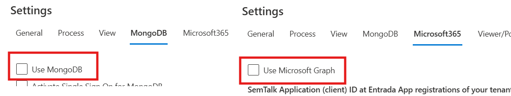
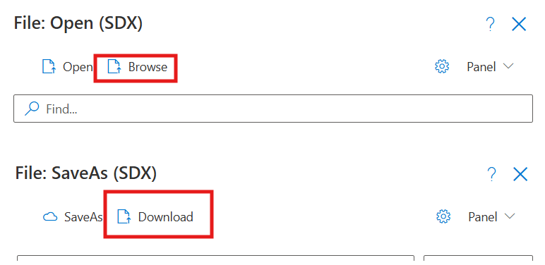
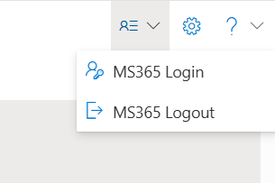
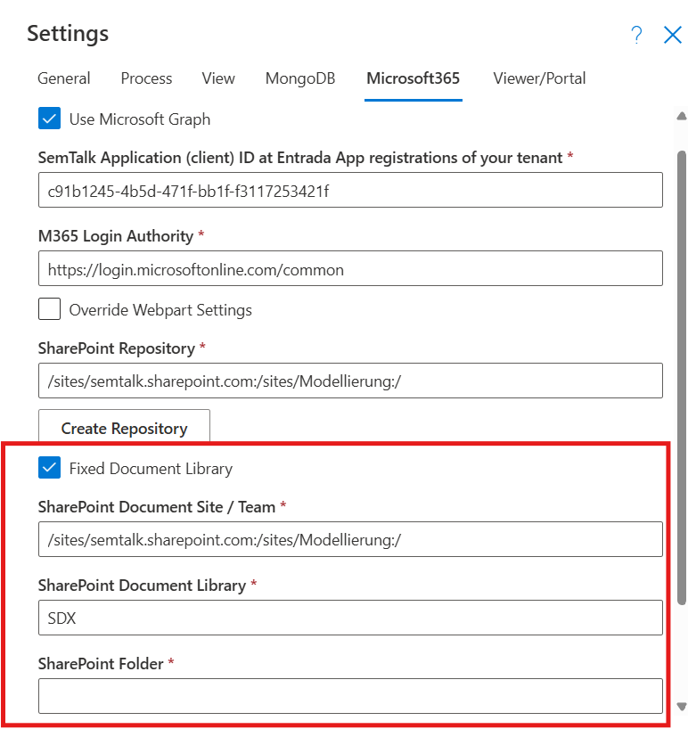
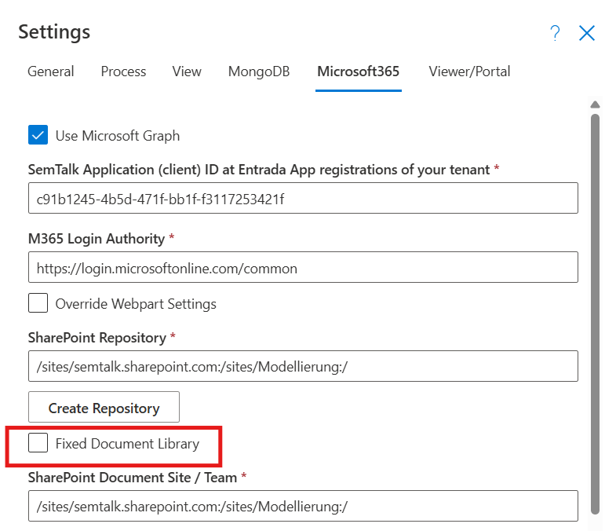
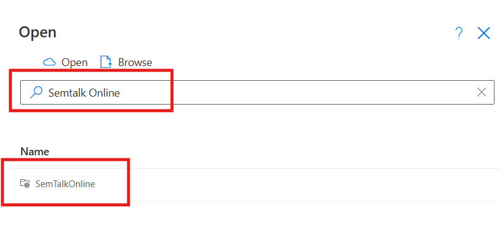
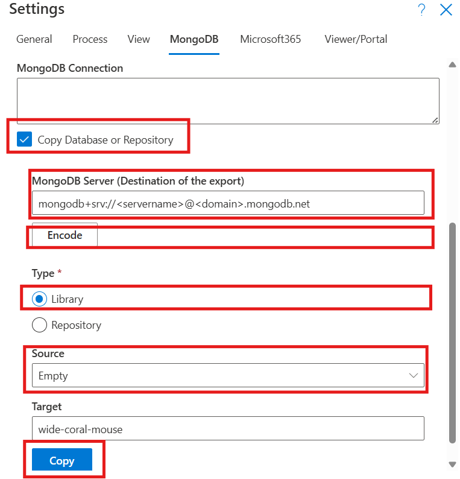
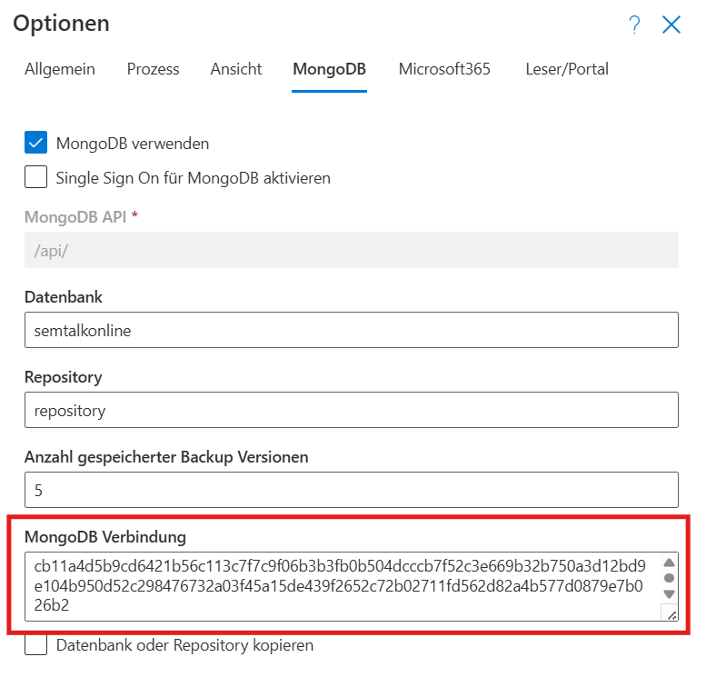
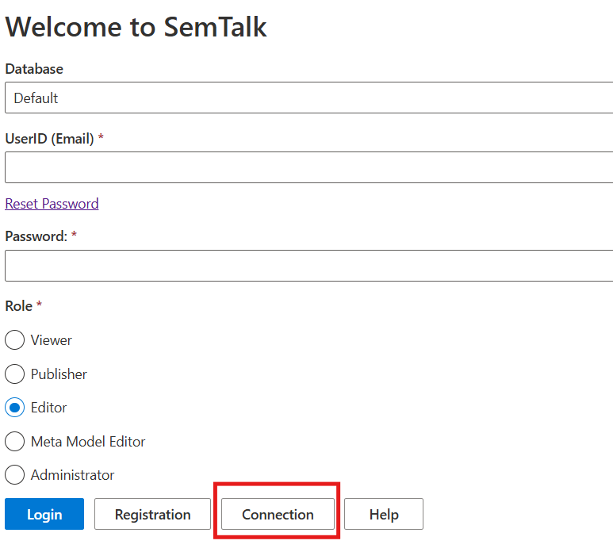
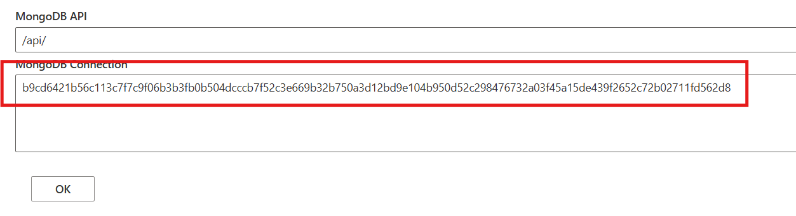

# Saving SemTalk Files

SemTalk Online stores files in different formats

* Locally on the computer
* In SharePoint Libraries
* In a MongoDB

## Storing files Locally

Model files are stored locally on the specific computer being used. These models can only be opened and saved from that computer.

If MongoDB and Microsoft Graph are disabled in SemTalk Online options, and if the user is not working in a SharePoint context, SemTalk Online switches to Local mode. The "Save" or "Save As" for the current model file is automatically stored in the user’s Downloads folder.
The Open dialog allows users to select a file from the Downloads folder via the file Explorer.

If MongoDB or Microsoft Graph are enabled, files can still be stored locally. In this case the Save dialog provides a "Download" button, and the Open dialog offers a "Browse" button.

## Storing files in SharePoint Libraries

### Advantages
If users have access to a SharePoint server, they can store files directly in SharePoint Libraries. This option has the advantage of integrating SemTalk Online seamlessly into the company’s existing file structures. User and access management can be organized via existing Microsoft 365 accounts with their corresponding permissions in Teams or SharePoint.

In addition, SharePoint's file management functions can be used for SemTalk Online files. (e.g. versioning, metadata columns, etc.)

### Login process
If Microsoft Graph is enabled, or if SemTalk Online is used in a Microsoft SharePoint context, files can be stored in SharePoint libraries. In this case users must be logged in with their Office 365 account.

If SemTalk Online is run as a Teams tab, or within the Microsoft 365 environment, SemTalk Online uses the user’s account and grants permissions to access files via Microsoft Graph.
In some cases it may be necessary to log in again using the user's M365 Login button.

When using SemTalk Online after it has been activated in Microsoft Graph, a login with the user’s Microsoft 365 account is mandatory. Microsoft 365 account login will also be required again for each session, since the web application runs outside the user’s Microsoft 365 environment.

## Using a predefined fixed Library

SemTalk Online can be configured to use a fixed, predefined SharePoint Library shared by all users. This option is especially important when several modelers are working on a specific model file, in a structured way, over a long period of time.

It is also possible to use a specific SharePoint Library when SemTalk Online is used as a tab in Microsoft Teams, as a SharePoint WebPart, or as a web application that has access to a SharePoint server.

The integration option is found in the Microsoft 365 tab in SemTalk Options. In the shown example, the Library is named "SDX" and it is located in the site called "Modellierung". It is also possible to specify a specific folder. Users must have SharePoint read/write permissions to open and save files in a given SharePoint Library.

User's with Administrative rights can change settings for all other users and they can set them as default.
When SemTalk Online is used as a tab in Microsoft Teams, the Library name and the SharePoint site, must be entered directly in the configuration tab when it is created.

## Working without a fixed Library

It is also possible to work in a mode where the file storage location can be chosen for every Save or Open operation. This can be enabled by disabling the "Fixed Library" option in the SemTalk Online settings. Users can then freely decide where files are stored or opened.

When SemTalk Online is used as a Personal App, it automatically defaults to not having a Library because Personal Apps do not exist as SharePoint structures and therefore do not have available Libraries or other storage options.

Fixed SharePoint Libraries can be disabled in SemTalk Options.

When Opening or Saving files when using a fixed Library, a SharePoint site must always be selected. This is done by entering the SharePoint site name, or part of the name (of which the user is a member) into the Search box. SemTalk Online will show all matching SharePoint sites and allow the user to navigate to the desired Library.

## Storing files in MongoDB

### Advantages
MongoDB is well-suited as a database for SemTalk Online because it offers a flexible, document-oriented structure. Model information, metadata, and user interactions can be stored directly as JSON-like documents without requiring a rigid schema. This simplifies the management of complex and variable model contents.

MongoDBs can be hosted in the Cloud, as well as on your own servers, making them flexible and easy to set up. This is why MongoDB was chosen as SemTalk's database system for SemTalk Online outside of Microsoft environments.

When SemTalk Online is used with MongoDB, all users must have accounts on the MongoDB and login before they can work with it.

## Creating and setting up a MongoDB

On request, Semtation GmbH Support can help new customers set up and maintain a MongoDB server. Customers always have the option to independently manage and operate the MongoDB server themselves.

A MongoDB account can be booked in the Cloud via https://account.mongodb.com/
It can also be created and operated directly in Microsoft Azure.
If your organization has its own server infrastructure, MongoDB can also be installed locally: https://www.mongodb.com/docs/manual/installation/

Once the MongoDB server has been set up, the server connection string must be converted into an encrypted token, which must then be stored in SemTalk Online.

Guidance for MongoDB's final setup can be found in SemTalk Online Options under the MongoDB tab.

- Select Copy Database or Repository
- Paste the server’s connection string into MongoDB Server
- Click Encode and store the generated connection token in a safe place (this token can later be entered in the MongoDB Connection field to connect to your DB)
- In the field Type, select Library
- Under Source, select Empty. This represents an Empty DB that serves as a template for the new database
- Under Target, enter the name of the new database collection, e.g. semtalkonline. This collection will be created on the server during the copy process and filled with the corresponding database tables
- Finally, click Copy. The new database will now be initialized with the basic information.

## Storing the MongoDB Connection Token
MongoDB Token storage in SemTalk Online depends on the type of SemTalk Online application.

In the web application, the Token can be inserted into the MongoDB Connection field in Options under the MongoDB tab. More importantly, it can be entered on the SemTalk Online start page. There, the Connection button must be used to store the Token. When SemTalk Online is started for the first time, SemTalk Online will immediately load the corresponding MongoDB server.

If you want to set up a MongoDB while SemTalk Online is hosted in a Microsoft 365 environment, please refer to the corresponding Wiki pages for more information.

