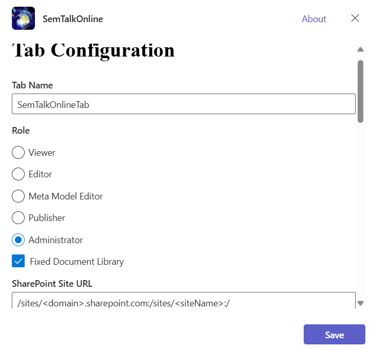
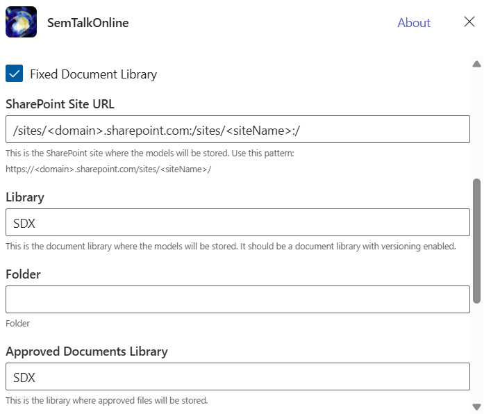
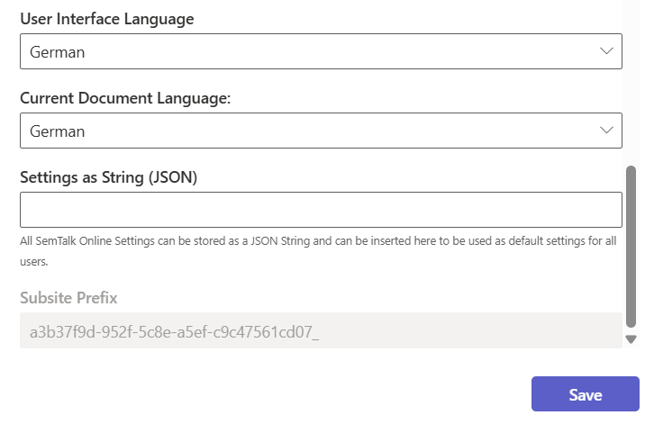

**SemTalk Online** integrates seamlessly into the Microsoft 365 environment. This allows organizations to use the SemTalk Online App directly within familiar Microsoft environments such as Microsoft Teams, Outlook, and other Office 365 services. By embedding the SemTalk Online App into the existing Microsoft environment, users benefit from a unified workspace where process modeling, collaboration, and knowledge management are fully connected within the tools they use every day.

# SemTalk Online as a Personal Tab in the Microsoft 365 Environment

Users can set up the SemTalk Online as a personal tab in Microsoft products such as in Teams or Outlook Online. Select SemTalk Online from the "More Apps" menu of the respective Microsoft application.

This scenario is particularly suitable when individuals are executing modeling projects that do not require them to manage a large number models.

When modelers are using SemTalk Online App as a personal app, there is separate app setting in Teams or Outlook, no SharePoint site in the background, and no caching of personal settings. In this case, it is recommended to work without a fixed Model Library.
More details can be found under [File storage options](https://github.com/SemTalkOnline/SemTalkOnline/wiki/SemTalk-Online-Options-for-file-storage).

# SemTalk Online as a Microsoft Teams Channel Tab

This option provides an optimal way for modeling groups to work together when executing SemTalk Online projects. All authorized Team members have access to the same app, with the same settings and configurations.
In addition, all of Microsoft Teams' functionalities can be used to make the modeling experience more efficient and collaborative (e.g. chat function, integration of related libraries and other information). SemTalk Online's data storage can also be specifically set to a Library within the respective Team. Other settings can also be predefined by the SemTalk Online App's administrator for all SemTalk Online App users.

This is specifically recommended when executing and managing larger, and more detailed modeling landscapes with multiple modelers over longer time periods.

## Adding SemTalk Online as a Teams Tab

The SemTalk Online can be added as a Microsoft Team Tab in a Channel using Team's standard settings. All Channel members will have access to the App.

Users are prompted to fill in the Tab configuration during the initial setup.

## Configuring the Tab

SemTalk Online's configuration screen provides the user with all of the basic setting options to preset the app for different use cases.
These settings will be applied to all Tab users unless individual users change their personal settings and thereby override the Tab defaults.

- Tab Name: The Tab title that should be displayed.
- Role: Role in which the app should run.
- fixed Document Library: Sets SemTalk Online to a mode in which all users have access the same single document library.
This document library must be explicitly specified.
The four following fields are used for this purpose.
In the mode without a fixed library, these fields are hidden.

- SharePoint Site URL: If a fixed library will be used for storing files, the URL of the SharePoint site must be specified here.
- Library: The name of the fixed library. This must first exist on the previously specified SharePoint site.
- Folder: A specific folder from the Library can be specified here as needed.
- Approval Library: If an approval storage is required for shared processes, an additional Library is required. This Approval Library must have a different name than the regular model library.

- UI Language: The language in which the SemTalk Online App interface is displayed.
- Current Language: The language in which the model content will be created.
- Settings String: SemTalk Online allows all option settings to be exported as a JSON string. This string can be entered in this field to provide the same default settings for all users.
- Subsite Prefix: Each SemTalk Online App gets an individual prefix. This is used to cache user-specific settings on the computer for each Portal instance.

# File Storage Options in the Microsoft Environment

More detailed information about SemTalk Online’s file storage concept can be found on the page [File storage options](https://github.com/SemTalkOnline/SemTalkOnline/wiki/SemTalk-Online-Options-for-file-storage).
There you can also find information about the available options in the Microsoft 365 environment.

