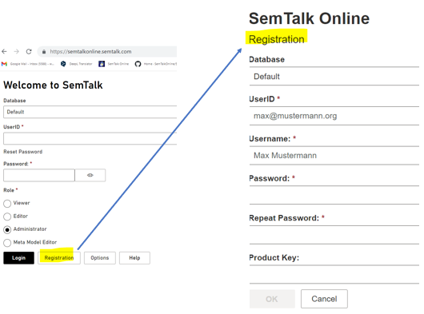

**Registration**: First time users must complete the Registration form. 

If a user account does not exist, Registration can be performed if this function is enabled in the application. 

Demo users are able to register for testing purposes free of charge and will automatically be assigned the Editor role. Demo users should leave the Product Key entry empty.