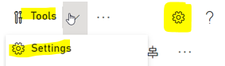
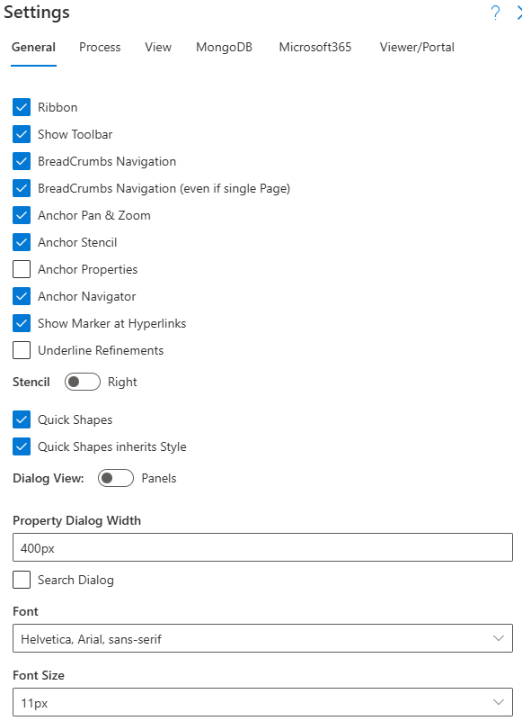

# SemTalk Online Settings

Access Settings using the Settings Icon in the toolbar or by selecting **Tools - Settings**.

**General SemTalk Options**:  Options are used to select general tool settings, GUI and modeling languages and to integrate model information with **Databases**, **Repositories** and external applications such as Microsoft Graph. 

**SemTalk Settings**:

* **General**: Selects or deselects key SemTalk functions
* **Process**: Customizes BPMN Diagram functions to meet user requirements
* **View**: Default layouts for text and objects and selects the GUI and Model Language settings
* **MongoDB API**: Integrates SemTalk with MongoDB databases
* **Microsoft 365**: Integrates SemTalk with MS Graph, Sharepoint, and other Microsoft software
- **Viewer/Portal**: Manages the model's Portal settings

## Settings - General

* **Ribbon**: Shows or hides command Ribbon
* **Show Toolbar**: Shows or hides Toolbar
* **Breadcrumb Navigation**: Shows the Breadcrumb Diagram navigation bar
* **Breadcrumb Navigation (even if single Page)**: Shows Breadcrumb Diagram Navigation even when the model only contains a single page
* **Anchor Pan & Zoom**: Anchors or hides Pan & Zoom window
* **Anchor Navigator**: Anchors or hides the Navigator window
* **Show Marker at Hyperlinks**: Shows or hides paperclips on Tasks to show available Attachments
* **Underline Refinements**: Shows Refinements as underlined Task names
* **Stencil (Right or Left)**: Moves the Object **Stencil** window to the right or left of the modeling page
* **Quick Shapes**: Turns on and off the ability to connect Quick Shape Objects via right clicking on a process Task Object 
*  **Quick Shape inherits Style**: Quick Shape Objects inherit the Style of the parent shape
* **Dialog View (Panels and Windows)**:
  - Property Dialog Width
  - Search Dialog
Auto Checkout
* **Font**: Selects Font, Font Size, Height, and Width, Text Label Width, Link Label Width
*  **Allow negative Coordinates**: This allows users to navigate in large models where modeled Objects may be outside of Coordiate settings

*  **Coauthoring Refresh (milliseconds > 6000)**: In collaborative modeling projects, Administrators can automatically set the model's refresh time to regularly update the model to show changes made by all users working on the same model

