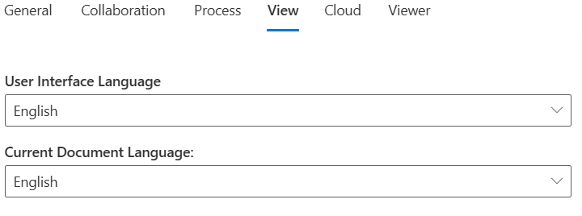
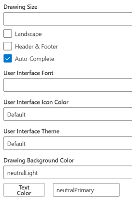
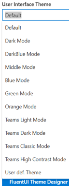
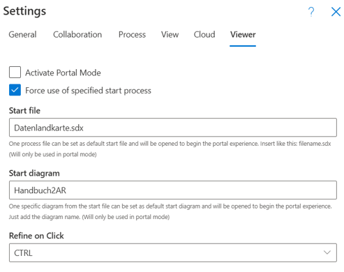

# SemTalk Online Settings

Click on the gear icon  found to the far right of the Pull-Down menu to open General Setting.

Settings are used to structually and visually customize SemTalk Online.

Setting functions include:
 
  * Determine what commands are shown or hidden,
  * Set the **Shape**, **Navigation** and placement options on **Diagrams**,
  * Customize **Pull-Down Menues & Layout**,
  * Determine relevant **Properties** for each **Object** type, and
  * Link models to external content and tools, and
  * They set **Collaboration** rules for projects with multiple modelers.

## Settings - General

**Settings - General** sets the parameters for the modeling interface as well as the **BreadCrumb** navigation settings to navigate between **Diagrams**.

## Settings - General:

  * **Ribbon**: Shows or hides Toolbar
  * **Toolbar**: Shows or hides Toolbar
  * **BreadCrumb Navigation**: Shows the Breadcrumb Diagram Navigation Bar under the Toolbar. This allows users to quickly navigate to connected higher and lower process **Diagrams**.
  * **BreadCrumb Navigation (even if a single page)**: Shows Diagram Name for single, unlinked pages

  * **Anchor**: The **Anchor** settings are used to show or hide **Pan & Zoom**, **Stencil**, **Properties**, **ChatBot** and **Navigation** Windows. 

    **NOTE**: These modeling tool windows can be turned on and off. Modeling windows are generally turned off when showing model data to end-users so that the focus is clearly on process flow information.

  * **Marker at Hyperlinks**: Shows Hyperlink markers on Objects with linked Documents and Pages.
  * **Underline Refinements**: Underlines the Object's name to show that the Object has an associated **Refinement**.
   * **Left, Right or Floating**:  **Pan & Zoom**, **Stencil**, **Properties**, **ChatBot** and **Navigation** windows can be anchored to the Left or Right or they can be floated on top of the open Diagram
  * **SemTalk CoPilot**: Integrates model data with CoPilot features that are able to suggest next steps or to replace existing model data with data linked via BPMN models. If there is not associated **BPMN** model data, external Object data can be integrated via **Knowledge Graphs**.

**Quick Shapes**: Modelers can rapidly add Objects and Connectors directly from existing **Business Process Diagram Objects** onto the active **Diagram**. Available **Objects** and **Connectors** are shown when the cursor is hovered over an existing **Business Process Diagram Object**. **Quick Shape** features and **Style** can be activated for all future **Business Process Diagram Objects** by turning on **Quick Shapes inherits Style**.

  * **Property Dialog**: Sets the **Format** and **Style** of **Properties**
  * **Allow Negative Coordinates**: Allows 
  **Diagram Objects** to be visualized without Page Layout constraints. 

  

 
  * **ChatGPT API**: Allows modelers to add an access key for their ChatGPT app
 * **Intro Screen**: Turns on and off the **Welcome Screen** that appears when SemTalk Online opens
 * **Namespace**: Adds the **Namespace** Adds a '#' plus Object type abbreviation before an Object's name. This is used primarily when creating Ontologies.

 * **Dialog View**: 
* **Font (Parameters)**: Selects Font, Font Size, Height, and Width for scaling to other applications (e.g. SharePoint)
**Symbol Scale Factor**: Scales all symbol shapes in the model
* **Resize**: Allows all shapes to allow users to determine their shape size. When selected, Style Resize is set to 'on'.

### Additional Customization General Settings:

  * **SplitEnable**: Allows modelers to add Objects between two Objects on a Process Diagram so that the new Connectors are generated automatically
  * **RotationEnabled**: When enabled, individual Objects can be rotated. Click on an Object and a blue dot will appear. Click on the blue dot and rotate the Object as needed. NOTE: After turning on RotationEnabled, refresh your model to activate.
  * **UMLClass Shape in Ontologies**: Allows Class models to be shown as standard UML class representations.
  * **Auto Save png**: Saves added .png files that can be used by other modelers. Caution must be used when this setting is turned on because it greatly increased the model file size.
  * **Export to Repository after each 'Save**: This setting is used by Model Administrators and Editors to upload Objects into a general shared Repository

## Setting - Collaboration

**Setting - Collaboration** is used when multiple modelers are working on a model at the same time. 

* **Auto Checkout**: When a modeler closes an open model, all of their changes will be automatically saves
* **Auto Save**: Saves process-related changes immediately after the change is made. Layout changes may not be saved.
* **Coauthoring and Coauthoring Refresh**: Allows 2 or more authors to set rules for the refresh function so that changes are not lost between modelers. The refresh bar sets haow many seconds there are between changes made by each modeler.
* **Change Log**: Creates a list of all changes that occur in Collaborative models as well as the ability to add comment to a change that was made.

## Settings - Process

**Settings - Process** is used to customize Objects in the the chosen methodology (e.g. BPMN and EPC) and to turn process flow-related features on and off. 

* **BPMN Rules**: Often models are used for representations of process flows that are not specifically part IT structure representations. setting BPMN Rules to a flexible model allows additional relevant process information to be added to the Diagrams.
The following methodology-related features are left on or off depending on what is being modeled.

* BPMN Dialog
* BPMN Sequence Flow/ Message Flow Rules
* BPMN Event Type
* Refine Creates Multiple Entry/ Exit Objects
* Simulation Dialog

* Object Flow: This is where the direction of a process flow is set. 

* Swimlane Labels
* Swimlane Labels in Breadcrumbs: This setting allows users to use the breadcrumb navigations to go to Connected Diagrams that are above or below the currently opened Diagram.

* **Swimlane Spacing**: Specifies the spacing between the swimlane cells when there are multiple Sub-Swimlanes. 

* **Planner Integration**: Models can be integrated with Microsoft Planner to coordinate modeling activitives when multiple users are modeling.

## Settings - View

### Language Settings in SemTalk Online

SemTalk differentiates between the **User Interface Language** (SemTalk Online GUI language) and the **Current Document Language** used for naming **Objects**, **Connections** and **Artifacts**. 

**User Interface Language** Settings are SemTalk Online Commands. Edits are managed by the SemTalk Online development team.

* **Current Document Language**: The Document Language is the language used when naming Objects, 
Diagrams and other content such as Comments. Multiple Document Languages are managed via Reports that can have columns of multiple langages that can be imported to show content based on the local language of the readers.

Both the **User Interface Language** and the **Current Document Language** support the following 9 languages. If other Languages are needed, modelers can usually adapt the **Current Document Language** to other languages depending on whether support exists for characters that are unique to the individual language. 

### Settings - View - Drawing

* **Drawing Size**: Document size parameters are set via a pull-down list of standard document sizes.
* **Landscape**: Converts modeling documents between vertical and horizonal page settings. The standard default is Verticle.
* **Header & Footer**: Turns the Header and Footer document settings on and off.
* **Auto-Complete**: Automatically shows possible Object names dynamically in the combo box.

### General Document Settings
* **User Interface Font**: Opens Font pull-down menu
* **User Interface Icon Color**: Users can customize the SemTalk Online button menu to change to different colors.
* **User Interface Theme**: Opens a pull-down menu of available Themes.
    Themes refers to **Fluent UI Themes** that are structured, design-token-based parameters used to define the visual appearance of an application that include colors, typography, and spacing—of Objects across the modeling environment. SemTalk Online includes the following Theme options. 
    
    
    
    Modelers can adjust available Themes using the **User-Defined Theme** function.

* **Drawing Background Color**: This is the default color for Diagram backgrounds
* **Text Color**: Opens a pull-down menu of available text colors
* **User-Defined Theme**: If modelers or organizations have defined Themes, code for predefined  **Themes**, can entered here. Luent UI Themes can be created https://fluentuipr.z22.web.core.windows.net/heads/master/theming-designer/index.html

Set the desired paramenters for Icon heights and widths by using:
* **Icon Height**
* **Icon Width**
  
## Settings - Cloud

**Settings - Cloud** is used to
set external connections to and from SemTalk Online, define backup options, copy database and repository information and to Use Microsoft Graph
* **MongoDB**: MongoDB is the standard format for Object
* **Activate Single Sign On for MongoDB**: Allows users to access MongoDB with their Microsoft account
* Keep me signed in
* **MongoDB API**: Pathname to MongoDB
* **Repository**: Name of the associated Repository
* **Number of Backup Versions**: Determines how many backups should be saved centrally. Generally limited to 15

### **Settings - Viewer**

**Settings - Viewer** sets the Portal Start File and it contains relevant Portal Settings.
* **Activate Portal Mode**: Activates the model's Portal site
* **Force use of specified start process**: Overrides other setting to fix which Diagram will open as the Start Page for the Portal
* **Start File**: Link to the specific SemTalk Online file
* **Start Diagram**: Link to the default Diagram that opens on start
* **Refine on Click**: Sets the navigation paraemter for opening Refinements
* **Portal Mongo DB Connection**: Link to the Portal's MongoDB
* **Portal DB**: Shows the DB associated with the Portal
* **Portal Library**: Link to the Library associated with the Portal
* **Portal Backend**: Backend for Portal Administrator
* **Ribbon**: Sets which Pull-Down bars and Toolbar tools are visible