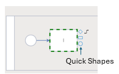

The SemTalk user interface is comprised of:

**Pull-down menu bar**: Contains all available SemTalk Commands 

**Zoom Window**: Diagram Navigation Tool

**Diagram Window**: Diagrams are SemTalkOnline's modeling workspaces where Objects and their relationships are drawn. Each SemTalk Methodology has a predefined set of associated Diagram Types.  For example, if BPMN is selected, Business Process Diagram, Object, Ontology and Org Chart Diagrams are available.

**Stencil**: Stencils show graphical Objects that represent all available Objects for the currently selected diagram. 

Users can customize what appears in the modeling view by clicking on the **Settings Icon** in the upper right corner of SemTalk Online window and selecting **Settings - General**. 

**Settings - General** is where modeling default settings are set. SemTalkOnline modeling windows can be shown or hidden. For example, turning off modeling tool windows is especially helpful when getting feedback from process experts because the focus remains on the process flow Diagram, not the the modeling command windows. Other modelers, working on the same model, turn the missing windows back on here.

**Settings - General - Anchor** is used to Anchor windows to the left or the right side of the SemTalk Window.

- **Breadcrumb Navigation**: When a model contains multiple linked Diagram pages, a breadcrumb path can be displayed to help navigate between linked pages.
- **Display Hyperlinks as Icons**: This option is used to show a **Hyperlink Icon** on Objects that have associated hyperlinks.
- **Underline Refinements**:  Used to show if a BPMN Object is Refined. The **Task Name** will be underlined. If this option is disabled, the standard BPMN **+** symbol will be shown.

- **Quick Shapes**: Automates the modeling process by showing possible Objects that can be connected to the selected Object. 
 
  